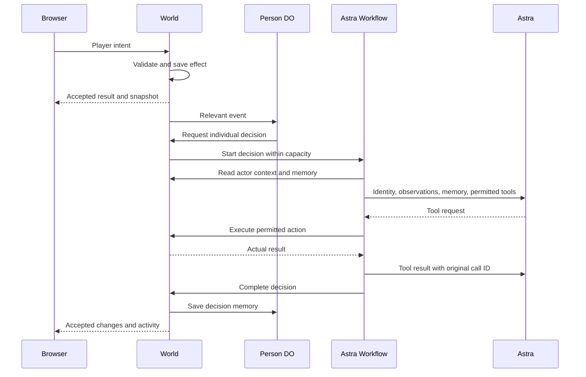

# GPT8 — v3 integration plan

Status: integration and manual deployment are complete. The game is live at **https://grandtheftastra.com**.
The combined repository passes local checks. A full browser mission and restart check remain open.

## Goal and scope

Build a playable, understandable v3 prototype in one TypeScript monorepo. Use Angela's actual Red Square scene and retain her asset pipeline.
Astra chooses NPC speech and actions. The game validates actions and owns money, ownership, mission rewards, and physical state.

1. Preserve Angela's Git history, assets, editable Blender sources, original prototype, and original tests.
2. Port the React game, Cloudflare backend, shared schemas, and existing checks into `apps/` and `packages/`.
3. Connect third-person movement, vehicles, dialogue, a city overview, and the shelter mission to Angela's scene.
4. Retain 100 individual Person Durable Objects, World SQLite, and asynchronous Astra Workflows.
5. Validate the integrated game and push the changes without replacing concurrent remote work.

This pass excludes new asset production, full GTA combat, traffic simulation, and broad economy systems.
Angela owns assets and visual React work. Alexander owns game systems, shared contracts, CI, and deployment.
Both work in `apps/web/`; coordinate shared files before editing. `AGENTS.md` defines the Git and verification workflow.

## Run and repository ownership

```sh
pnpm install
pnpm dev
```

The new game uses **http://localhost:3000** and a Cloudflare backend on port **8787**.
`pnpm start` preserves the original prototype on **http://localhost:4173**.
These games use separate saved data and mission rules. The original prototype does not acquire Astra support through this port.

| Path                                                      | Responsibility                                                             |
| --------------------------------------------------------- | -------------------------------------------------------------------------- |
| `apps/web/`                                               | React, R3F, Rapier, controls, camera, interface, and asset integration     |
| `apps/server/`                                            | Worker, World and Person Durable Objects, SQLite, and Astra Workflows      |
| `packages/core/`                                          | Shared schemas, JSON-RPC methods, game rules, coordinates, and collisions  |
| `public/assets/`, `source/blender/`, `source/characters/` | Angela's runtime assets, editable sources, export scripts, and attribution |
| `public/*.js`, `server.mjs`, `world.mjs`, `test/`         | Original prototype and its verification                                    |

The default pnpm catalog owns new game dependencies. The named `legacy` catalog preserves the original prototype's dependency versions.
Applications import shared packages; applications do not import each other. Root `AGENTS.md` applies to all contributing agents.

## Deployment

The `gpta-world` Cloudflare Worker serves **https://grandtheftastra.com**.
The web build produces static, prerendered HTML. The same Worker handles `/api/*`, including sessions and the game WebSocket.
Browser API requests use the same origin as the page.

Run manual deployment from the repository root:

```sh
pnpm deploy
```

The command builds the web app and deploys the Worker with its static assets.
`OPENAI_API_KEY` is configured as a Cloudflare secret and in ignored `apps/server/.dev.vars` for local development.
Keep secret values and local saves out of Git.

Alexander will connect the Git repository to Cloudflare. Use the repository root as the build directory.
Set the build command to `pnpm check` and the deploy command to `pnpm --filter @gpta/server deploy`.
This configuration checks the combined code and builds the web assets before deployment.

## Asset integration

The new web app reads the existing `public/assets/` through the `apps/web/public/assets` symlink.
Asset integration does not duplicate the GLBs or replace their original Blender sources.

The game uses Angela's native meter coordinates. `packages/core/src/scene.ts` owns shared bounds, interaction anchors, and collision footprints.
The scene loader applies its declared vertical offset. Player movement, server validation, minimap projection, and camera framing use the same scene definitions.

Stable entity IDs connect visual objects to simulated people and locations. Character animation reflects accepted movement and dialogue.
Coordinate migration must preserve existing balances, mission progress, shelter, ownership, conversations, and Person memory.
The integration must move incompatible saved positions into valid locations without resetting the saved world.

## Game and AI ownership

| Component             | Owns                                                                                       |
| --------------------- | ------------------------------------------------------------------------------------------ |
| Browser               | Rendering, input, local physics, interpolation, and inspection                             |
| World Durable Object  | Canonical positions, money, ownership, missions, incidents, sessions, and accepted effects |
| Person Durable Object | One NPC's persistent memory and independent decision schedule                              |
| Astra Workflow        | Provider requests, tool calls, and continuation with actual tool results                   |

The browser sends intent through one JSON-RPC WebSocket using the `gpta.v1` subprotocol.
The server supplies player identity from an anonymous HttpOnly session. It validates proximity, movement, prerequisites, permissions, and balances.
Lasting effects and idempotency receipts save before acknowledgement. Reconnect restores a snapshot before actions become available.



All 100 NPCs are canonical entities. Each Person object has a schedule and recent memory; the World owns its physical state.
One-second World alarms continue without connected browsers while the backend runs. Connected browsers receive movement updates every 200 milliseconds.
Astra selects destinations; the simulation advances accepted movement while other decisions remain pending.

The World permits two concurrent decisions. Workflows permit four response rounds and apply explicit provider deadlines.
The official OpenAI SDK calls the Responses API with configurable `gpt-6-astra`.
The available tools include `say`, `go_to`, `report_crime`, `dispatch_police`, `set_price`, and authorized mission offers.

Tool effects use decision and call IDs for idempotency. The World checks current permissions and state again when a tool executes.
The inspector exposes actual decisions, tool results, failures, and Person memory. It does not present scripted decisions as Astra output.
Without a key, the interface shows **Astra disabled**. Provider failures leave simulation movement running.

## Shelter mission and persistence

New players start with **₽20**. Mila offers a parcel delivery with two valid completion choices.

| Action                 | Accepted effect                                                    |
| ---------------------- | ------------------------------------------------------------------ |
| Accept Mila's delivery | Mission changes to carrying; derived inventory includes the parcel |
| Deliver to Lev         | Adds ₽80 and 1 reputation; completes the mission                   |
| Deliver through Niko   | Adds ₽60 and 1 reputation; completes the mission                   |
| Rent Irina's bed       | Deducts ₽60 and saves rented shelter                               |

Repeated delivery cannot grant another reward. Entering and leaving the guesthouse use validated actions.
Taking a vehicle changes ownership and can create a witnessed theft. Exiting preserves ownership.
Astra can report observed crime and dispatch an authorized officer through game tools.

World SQLite stores snapshots, sessions, and action receipts. Person objects store their own memory and schedules.
The new game's local saves remain in `apps/server/.wrangler/state`; the original prototype keeps its separate `data/` directory.
Local secrets remain in ignored files such as `apps/server/.dev.vars`. Neither secrets nor local saves enter Git.

## Verification and current evidence

Before this port, a real WebSocket session completed direct delivery, guesthouse entry, and bed rental.
Its accepted state contains **₽40 remaining, reputation 1, completed direct delivery, and rented shelter**.
A live Astra call produced speech, received a rejected tool result, and continued its decision.
These results verify the earlier game systems. They do not verify the integrated scene.

The combined repository passes `pnpm check`: lint, formatting, all package types, five core tests, ten original tests, and production builds.
The asset Storybook build also passes. An independent agent review finds no remaining integration blocker.
The integration preserves Angela's assets and the original prototype.

The live HTTPS start page and `/api/health` respond successfully. These checks do not verify a complete game session.

The integrated scene has not received a browser playtest. A full mission and restart check in the integrated scene remains for joint iteration.
V1 still uses simplified car physics and complete world snapshots. This pass does not establish large-world capacity or production readiness.

## Consolidated visual work — 10 September 2026

Continue GPT8 work in the task “Evaluate GPT8 GTA concept” (01a08bfb-a84c-73c2-92a4-91b3ebe7b377). Related tasks are archived with their histories retained; conversation histories are not physically merged. This repository is the shared source of truth.

- Vehicles: editable Ferrari-inspired car, sedan, and Mila scooter sources and exports are in `source/blender/vehicles/` and `public/assets/vehicles/`. Ferrari and scooter are integrated into normal gameplay. The canonical vehicle name remains “Blue sedan”; these are stylized approximations, not photorealistic replicas.
- Environment: integrated the reviewed lighting, shadow, paving, glazing, and museum facade improvements. See `docs/environment-polish.md` for measurements and limitations.
- Characters: Mila's current Blender study and six prototype NPC meshes remain available. Character concept provenance and team references are preserved under `source/characters/references/`. Exact likeness and deforming realistic replacement meshes remain unfinished.
- Higgsfield inside Blender: signed in and Mila reference attached. Last displayed balance was 6.68 credits; Tripo standard showed 9 credits and Meshy 7 standard showed 38. No new 3D generation was submitted. Installed Blender/add-on binaries, credentials, and transient session data stay local.
- Entry-page task: character-creator design direction was recorded, but connected generation was blocked by provider reauthentication; no completed entry-page implementation was delivered.
- Notion: the red MVP scope review was added and verified; the later checkpoint update was interrupted and remains unconfirmed. Page: https://app.notion.com/p/3d7c55d417b4801e98bfd5d68d56f8a4 .
- Browser verification from vehicle integration: connected gameplay displayed the car and scooter. Player physics readiness guards were added after a startup error; re-entry then produced no new reported errors. Full mission/restart verification remains open. Pushing these changes does not itself verify deployment of the new visual assets.

## Last Flight gameplay pass

The first stunt job is separate from existing parcel/shelter progress. Meet Mila, start Last Flight, enter your allocated stunt car, pass four amber gates in order (including two ramp approaches), park at the helicopter pickup and hand over the film on foot within 150 seconds. World validates the deadline, accepted ground positions, route order and single ₽250 / 2-reputation reward. Each player receives a stable personal mission vehicle; starting/retrying never resets another player's vehicle or progress. Failed attempts can restart at Mila. The helicopter is an animated pickup, not a flyable vehicle.

Driving now uses a separate physical car body, acceleration/reverse, speed-dependent steering and Space braking, with a chase camera. X/Z movement remains validated by the existing server speed/collision rules. Ramp height and airborne motion are local physics; remote snapshots still transmit ground-plane positions, so this pass does not claim synchronized airborne vehicle poses or physically accurate vehicle handling. Pedestrians make a bounded avoidance step near drivers; this is a simulation reflex, not model reasoning.

The HUD is now a full-width game view with a compact mission objective and optional Journal. Diagnostics, character memory and target selection remain expandable. Text inputs suppress movement, and controls stop when the page loses focus. Storybook states: http://localhost:6006/?path=/story/game-last-flight--briefing (requires `pnpm storybook`). The Blender Bell 206B-style helicopter replaces the provisional pickup geometry, with animated main/tail rotor pivots and a local departure presentation. It is still a photo-informed approximation.

Character follow-up: unnamed crowd members now use the existing rigged courier body with deterministic jacket colors, replacing capsule placeholders; named NPC assets remain unchanged. This is an interim silhouette/animation improvement, not approved-reference likeness. Task 01a08c8a-817b-79f1-b37a-a6f842b54a02 owns helicopter/vehicles; task 01a08c90-262a-7f73-8d18-a051f2eb0dac owns character refinement in a separate clone. Browser inspection confirmed the new HUD and human crowd rendering; the full stunt-driving playthrough and performance benchmark remain unverified.

### Helicopter asset, 10 September 2026

A photo-informed Bell 206B-style helicopter is available at `public/assets/vehicles/helicopter.glb`; editable source, build/validation scripts, references and actual GLB renders are in `source/blender/helicopter/`. It uses metres, +Z forward and Y up, with `MainRotor` at `[0, 2.82, 0]` (local Y spin) and `TailRotor` at `[-0.24, 1.82, -6.87]` (local X spin). Published rotor diameters are preserved; cabin and small details remain visual estimates. The source remains individually editable; runtime static fittings are consolidated. No mission/component changes are included. Integrated into Last Flight with animated rotor pivots. No character or environment-surface changes are part of this asset commit.

### Last Flight integration verification

A real local Worker/WebSocket session completed the complete ground-plane mission sequence: rejected a remote teleport, started at Mila, received its personal car, drove all four gates in order, parked, exited, and handed off the film. Result: ₽270 balance (₽20 + ₽250), 2 reputation, completed stunt state. Repeating the same idempotency key did not pay twice. Reconnecting with the test session restored the reward and completion. This created one separate local test player; existing player saves were not reset. This test exercised the live transport and rules, not the graphical steering controls.

A standalone Rapier run using the car collider, ramp transforms, timestep and straight-line acceleration from gameplay crossed both ramps and returned to the ground. Maximum body height was 3.61 m. This verifies basic ramp traversal; it is not a full hands-on browser driving test. The updated browser scene loaded without captured error logs. Combined checks and independent helicopter integration review passed. Full manual steering/camera playthrough and synchronized airborne multiplayer poses remain open. Helicopter departure is local presentation and replays on reconnect; it does not award mission effects.

### Mila refinement integrated

The refined `mila-study.glb` replaces the existing runtime asset at the same path. It improves facial proportions, bob silhouette, collar/cuffs and continuous sleeves/trousers with blended elbow/knee weights. The asset is 69,128 triangles (previously 113,016), 2.78 MB, with 13 bones, retained Idle/Walk and an added Greet clip. Source/runtime equality, finite floats, normalized weights and reimported animation poses passed production validation and independent review. The game currently selects Idle/Walk; adding a Greet clip does not automatically trigger it in dialogue.

Reference likeness is not accepted: materials and skin remain flat, hair layering/crown highlights are visible, hands/accessories are simplified, and Greet is an arm extension rather than a natural wave. Same-camera before/after views and reference are preserved in `source/characters/mila-study/comparison.html`. These asset checks do not substitute for a close-up gameplay likeness review.
The accompanying Ferrari asset pass replaces its separate roof slab with a continuous curved canopy and torus tyres with profiled meshes. Wheel pivot identities/positions and the game envelope are preserved. Matched-camera GLB before/after renders and validation are under `source/blender/vehicles/`; no driving or gameplay component changes are included.

### Rendering performance pass

Character animation now accumulates time and updates nearby rigs every frame, rigs beyond 40 m at 20 Hz, and beyond 100 m at 10 Hz. All bodies, authoritative positions, interactions and assets remain present. SSAO uses half-width/half-height targets (one quarter of the shading pixels), while the main render retains its pixel density and antialiasing. Composer sizing follows device pixel ratio changes.

An opt-in `?perf=1` overlay reports three-second average FPS and p95 frame time. Browser inspection found no captured errors; initial short samples were 62 FPS / 28.5 ms p95 before and 68 FPS / 19.9 ms after, but later samples varied down to 28 FPS in overview. These are uncontrolled development-browser observations with concurrent asset production, not proof of a stable frame-rate gain. Full driving performance remains to be benchmarked. Independent static review found no blockers.

Overview flicker fix: the city GLB contains `00 | Paved site`, which the old Ground/Terrain filter missed. Its top is only 8.5 cm below the replacement floor. Hide that complete node before mesh traversal and use a 0.3 m camera near plane to reduce distant depth fighting; physics ground remains unchanged.

The Ferrari now carries user-requested ivory `ASTRA MOBILE` lettering on both doors. Lettering is part of the runtime GLB; no gameplay or entity-name changes are included.

## Museum facade asset pass — 10 September 2026

An isolated building task adds an editable museum replacement in `source/blender/museum-detail/` and `public/assets/museum-detail.glb`. It retains the original mapped shell and collision coordinates, adds photo-informed arched facade geometry and roof materials, and supplies Blender/WebGL comparisons. Parent owns the loader integration: hide the complete old museum group, disable `museumDetail`, load the replacement at the shared scene offset. See `docs/building-accuracy.md` for evidence, validation and unresolved accuracy work.
