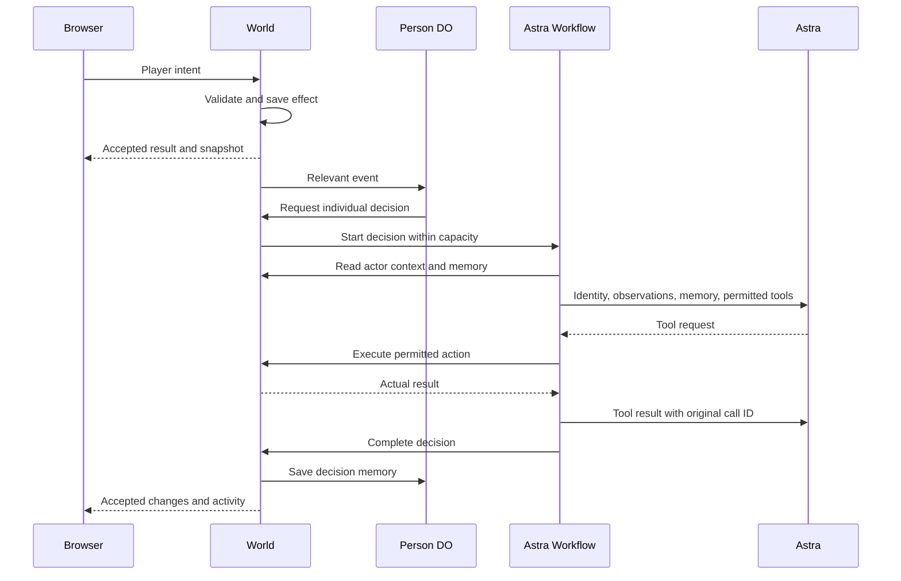

# GPT8 — v3 integration plan

Status: integration and manual deployment are complete. The game is live at **https://grandtheftastra.com**.
The combined repository passes local checks. A full browser mission and restart check remain open.

## Goal and scope

Build a playable, understandable v3 prototype in one TypeScript monorepo. Use Angela's actual Red Square scene and retain her asset pipeline.
Astra chooses NPC speech and actions. The game validates actions and owns money, ownership, mission rewards, and physical state.

1. Preserve Angela's Git history, assets, editable Blender sources, original prototype, and original tests.
2. Port the React game, Cloudflare backend, shared schemas, and existing checks into `apps/` and `packages/`.
3. Connect third-person movement, vehicles, dialogue, a city overview, and the shelter mission to Angela's scene.
4. Retain 100 individual Person Durable Objects, World SQLite, and asynchronous Astra Workflows.
5. Validate the integrated game and push the changes without replacing concurrent remote work.

This pass excludes new asset production, full GTA combat, traffic simulation, and broad economy systems.
Angela owns assets and visual React work. Alexander owns game systems, shared contracts, CI, and deployment.
Both work in `apps/web/`; coordinate shared files before editing. `AGENTS.md` defines the Git and verification workflow.

## Run and repository ownership

```sh
pnpm install
pnpm dev
```

The new game uses **http://localhost:3000** and a Cloudflare backend on port **8787**.
`pnpm start` preserves the original prototype on **http://localhost:4173**.
These games use separate saved data and mission rules. The original prototype does not acquire Astra support through this port.

| Path                                                      | Responsibility                                                             |
| --------------------------------------------------------- | -------------------------------------------------------------------------- |
| `apps/web/`                                               | React, R3F, Rapier, controls, camera, interface, and asset integration     |
| `apps/server/`                                            | Worker, World and Person Durable Objects, SQLite, and Astra Workflows      |
| `packages/core/`                                          | Shared schemas, JSON-RPC methods, game rules, coordinates, and collisions  |
| `public/assets/`, `source/blender/`, `source/characters/` | Angela's runtime assets, editable sources, export scripts, and attribution |
| `public/*.js`, `server.mjs`, `world.mjs`, `test/`         | Original prototype and its verification                                    |

The default pnpm catalog owns new game dependencies. The named `legacy` catalog preserves the original prototype's dependency versions.
Applications import shared packages; applications do not import each other. Root `AGENTS.md` applies to all contributing agents.

## Deployment

The `gpta-world` Cloudflare Worker serves **https://grandtheftastra.com**.
The web build produces static, prerendered HTML. The same Worker handles `/api/*`, including sessions and the game WebSocket.
Browser API requests use the same origin as the page.

Run manual deployment from the repository root:

```sh
pnpm deploy
```

The command builds the web app and deploys the Worker with its static assets.
`OPENAI_API_KEY` is configured as a Cloudflare secret and in ignored `apps/server/.dev.vars` for local development.
Keep secret values and local saves out of Git.

Alexander will connect the Git repository to Cloudflare. Use the repository root as the build directory.
Set the build command to `pnpm check` and the deploy command to `pnpm --filter @gpta/server deploy`.
This configuration checks the combined code and builds the web assets before deployment.

## Asset integration

The new web app reads the existing `public/assets/` through the `apps/web/public/assets` symlink.
Asset integration does not duplicate the GLBs or replace their original Blender sources.

The game uses Angela's native meter coordinates. `packages/core/src/scene.ts` owns shared bounds, interaction anchors, and collision footprints.
The scene loader applies its declared vertical offset. Player movement, server validation, minimap projection, and camera framing use the same scene definitions.

Stable entity IDs connect visual objects to simulated people and locations. Character animation reflects accepted movement and dialogue.
Coordinate migration must preserve existing balances, mission progress, shelter, ownership, conversations, and Person memory.
The integration must move incompatible saved positions into valid locations without resetting the saved world.

## Game and AI ownership

| Component             | Owns                                                                                       |
| --------------------- | ------------------------------------------------------------------------------------------ |
| Browser               | Rendering, input, local physics, interpolation, and inspection                             |
| World Durable Object  | Canonical positions, money, ownership, missions, incidents, sessions, and accepted effects |
| Person Durable Object | One NPC's persistent memory and independent decision schedule                              |
| Astra Workflow        | Provider requests, tool calls, and continuation with actual tool results                   |

The browser sends intent through one JSON-RPC WebSocket using the `gpta.v1` subprotocol.
The server supplies player identity from an anonymous HttpOnly session. It validates proximity, movement, prerequisites, permissions, and balances.
Lasting effects and idempotency receipts save before acknowledgement. Reconnect restores a snapshot before actions become available.



All 100 NPCs are canonical entities. Each Person object has a schedule and recent memory; the World owns its physical state.
One-second World alarms continue without connected browsers while the backend runs. Connected browsers receive movement updates every 200 milliseconds.
Astra selects destinations; the simulation advances accepted movement while other decisions remain pending.

The World permits two concurrent decisions. Workflows permit four response rounds and apply explicit provider deadlines.
The official OpenAI SDK calls the Responses API with configurable `gpt-6-astra`.
The available tools include `say`, `go_to`, `report_crime`, `dispatch_police`, `set_price`, and authorized mission offers.

Tool effects use decision and call IDs for idempotency. The World checks current permissions and state again when a tool executes.
The inspector exposes actual decisions, tool results, failures, and Person memory. It does not present scripted decisions as Astra output.
Without a key, the interface shows **Astra disabled**. Provider failures leave simulation movement running.

## Shelter mission and persistence

New players start with **₽20**. Mila offers a parcel delivery with two valid completion choices.

| Action                 | Accepted effect                                                    |
| ---------------------- | ------------------------------------------------------------------ |
| Accept Mila's delivery | Mission changes to carrying; derived inventory includes the parcel |
| Deliver to Lev         | Adds ₽80 and 1 reputation; completes the mission                   |
| Deliver through Niko   | Adds ₽60 and 1 reputation; completes the mission                   |
| Rent Irina's bed       | Deducts ₽60 and saves rented shelter                               |

Repeated delivery cannot grant another reward. Entering and leaving the guesthouse use validated actions.
Taking a vehicle changes ownership and can create a witnessed theft. Exiting preserves ownership.
Astra can report observed crime and dispatch an authorized officer through game tools.

World SQLite stores snapshots, sessions, and action receipts. Person objects store their own memory and schedules.
The new game's local saves remain in `apps/server/.wrangler/state`; the original prototype keeps its separate `data/` directory.
Local secrets remain in ignored files such as `apps/server/.dev.vars`. Neither secrets nor local saves enter Git.

## Verification and current evidence

Before this port, a real WebSocket session completed direct delivery, guesthouse entry, and bed rental.
Its accepted state contains **₽40 remaining, reputation 1, completed direct delivery, and rented shelter**.
A live Astra call produced speech, received a rejected tool result, and continued its decision.
These results verify the earlier game systems. They do not verify the integrated scene.

The combined repository passes `pnpm check`: lint, formatting, all package types, five core tests, ten original tests, and production builds.
The asset Storybook build also passes. An independent agent review finds no remaining integration blocker.
The integration preserves Angela's assets and the original prototype.

The live HTTPS start page and `/api/health` respond successfully. These checks do not verify a complete game session.

The integrated scene has not received a browser playtest. A full mission and restart check in the integrated scene remains for joint iteration.
V1 still uses simplified car physics and complete world snapshots. This pass does not establish large-world capacity or production readiness.
