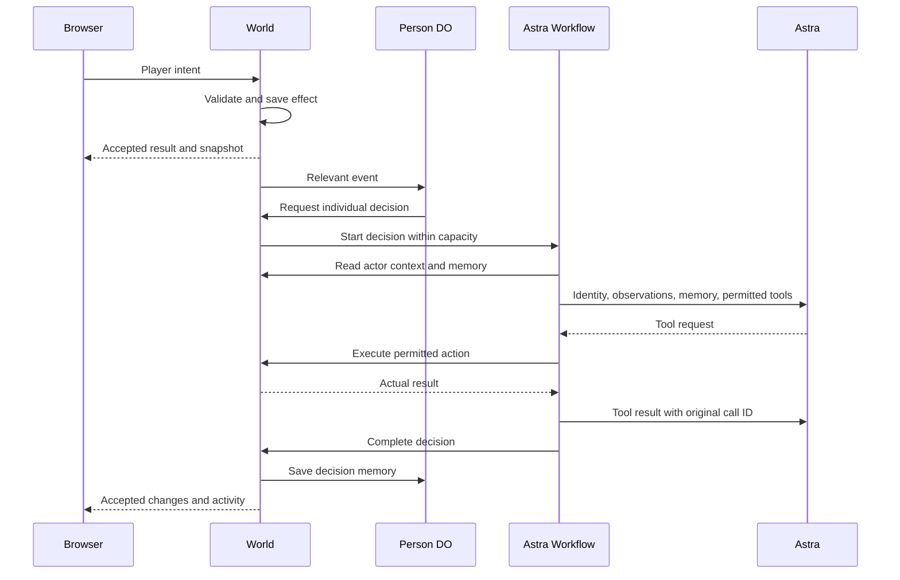

# GPT8 — v3 integration plan

Status: integration and manual deployment are complete. The game is live at **https://grandtheftastra.com**.
The combined repository passes local checks. A full browser mission and restart check remain open.
The physics v1 specification below is proposed for approval. This specification does not mark its checks as complete.

## Goal and scope

Build a playable, understandable v3 prototype in one TypeScript monorepo. Use Angela's actual Red Square scene and retain her asset pipeline.
Astra chooses NPC speech and actions. The game validates actions and owns money, ownership, mission rewards, and physical state.

1. Preserve Angela's Git history, assets, editable Blender sources, original prototype, and original tests.
2. Port the React game, Cloudflare backend, shared schemas, and existing checks into `apps/` and `packages/`.
3. Connect third-person movement, vehicles, dialogue, a city overview, and the shelter mission to Angela's scene.
4. Retain individual Person Durable Objects for the expanded 164-NPC cast, World SQLite, and asynchronous Astra Workflows.
5. Validate the integrated game and push the changes without replacing concurrent remote work.

This pass excludes new asset production, full GTA combat, traffic simulation, and broad economy systems.
Angela owns assets and visual React work. Alexander owns game systems, shared contracts, CI, and deployment.
Both work in `apps/web/`; coordinate shared files before editing. `AGENTS.md` defines the Git and verification workflow.

## Grand Theft Astra interface revision

**Status: the HUD, pause menu, and conversation layout failed visual review. Implementation is paused for specification approval.**

The [interface specification](visual-development/grand-theft-astra-menus.md) owns the proposed revision, inspected game screenshots, measurements, and acceptance checks.
It replaces the previous interface proposal. Application changes require Alexander's approval of that specification.

The generated artwork remains approved: one Red Square arrival image for the title and three rotating images during real loading.
The proposed revision uses a local radar, a usable map, compact pause rows, and conversation with the visible person.
The proposed tabs are Map, Quests, Inventory, Settings, and Game.
Free text retains the existing conversation and mission contracts. Physics owns targeting, movement, camera collision, and shared controls.

Use the existing components and assets. Keep technical details behind `VITE_GAME_DEBUG=true`.
Preserve concurrent conversation, physics, and music work. Do not build or update Storybook.
Alexander owns browser checks. Do not call the revision complete before he reviews the implemented screens.

The [interface guide](../apps/web/src/ui/README.md) describes the current components and asset paths.
Update that guide after the approved revision is implemented.
Previous checks do not establish visual acceptance; five physics integration tests timed out in the last complete check attempt.

## Run and repository ownership

```sh
pnpm install
pnpm dev
```

The new game uses **http://localhost:3000** and a Cloudflare backend on port **8787**.
`pnpm start` preserves the original prototype on **http://localhost:4173**.
These games use separate saved data and mission rules. The original prototype does not acquire Astra support through this port.

| Path                                                      | Responsibility                                                             |
| --------------------------------------------------------- | -------------------------------------------------------------------------- |
| `apps/web/`                                               | React, R3F, Rapier, controls, camera, interface, and asset integration     |
| `apps/server/`                                            | Worker, World and Person Durable Objects, SQLite, and Astra Workflows      |
| `packages/core/`                                          | Shared schemas, JSON-RPC methods, game rules, coordinates, and collisions  |
| `public/assets/`, `source/blender/`, `source/characters/` | Angela's runtime assets, editable sources, export scripts, and attribution |
| `public/*.js`, `server.mjs`, `world.mjs`, `test/`         | Original prototype and its verification                                    |

The default pnpm catalog owns new game dependencies. The named `legacy` catalog preserves the original prototype's dependency versions.
Applications import shared packages; applications do not import each other. Root `AGENTS.md` applies to all contributing agents.

## Deployment

The `gpta-world` Cloudflare Worker serves **https://grandtheftastra.com**.
The web build produces static, prerendered HTML. The same Worker handles `/api/*`, including sessions and the game WebSocket.
Browser API requests use the same origin as the page.

Run manual deployment from the repository root:

```sh
pnpm deploy
```

The command builds the web app and deploys the Worker with its static assets.
`OPENAI_API_KEY` is configured as a Cloudflare secret and in ignored `apps/server/.dev.vars` for local development.
Keep secret values and local saves out of Git.

`.github/workflows/ci.yaml` runs `pnpm check` for pull requests and pushes to `main`.
Successful pushes to `main` deploy the checked build with `pnpm --filter @gpta/server deploy`.
Manual workflow runs can deploy `main` too. Pull requests never deploy, and CI never runs paid conversation tests.
GitHub Actions requires the repository secrets `CLOUDFLARE_API_TOKEN` and `CLOUDFLARE_ACCOUNT_ID`.
The existing `OPENAI_API_KEY` stays in Cloudflare; deployment does not need a copy in GitHub.

## Asset integration

The new web app reads the existing `public/assets/` through the `apps/web/public/assets` symlink.
Asset integration does not duplicate the GLBs or replace their original Blender sources.

The game uses Angela's native meter coordinates. `packages/core/src/scene.ts` owns shared bounds, interaction anchors, and collision footprints.
The scene loader applies its declared vertical offset. Player movement, server validation, minimap projection, and camera framing use the same scene definitions.

Stable entity IDs connect visual objects to simulated people and locations. Character animation reflects accepted movement and dialogue.
Coordinate migration must preserve existing balances, mission progress, shelter, ownership, conversations, and Person memory.
The integration must move incompatible saved positions into valid locations without resetting the saved world.

## Game and AI ownership

| Component             | Owns                                                                                       |
| --------------------- | ------------------------------------------------------------------------------------------ |
| Browser               | Rendering, input, local physics, interpolation, and inspection                             |
| World Durable Object  | Canonical positions, money, ownership, missions, incidents, sessions, and accepted effects |
| Person Durable Object | One NPC's persistent memory and independent decision schedule                              |
| Astra Workflow        | Provider requests, tool calls, and continuation with actual tool results                   |

The browser sends intent through one JSON-RPC WebSocket using the `gpta.v1` subprotocol.
The server supplies player identity from an anonymous HttpOnly session. It validates proximity, movement, prerequisites, permissions, and balances.
Lasting effects and idempotency receipts save before acknowledgement. Reconnect restores a snapshot before actions become available.



All 164 NPCs are canonical entities. Each Person object has a schedule and recent memory; the World owns its physical state.
One-second World alarms continue without connected browsers while the backend runs. Connected browsers receive movement updates every 200 milliseconds.
Astra selects destinations; the simulation advances accepted movement while other decisions remain pending.

The World permits two concurrent decisions. Workflows permit four response rounds and apply explicit provider deadlines.
The official OpenAI SDK calls the Responses API with configurable `gpt-6-astra`.
The available tools include `say`, `go_to`, `report_crime`, `dispatch_police`, `set_price`, and authorized mission offers.

Tool effects use decision and call IDs for idempotency. The World checks current permissions and state again when a tool executes.
The inspector exposes actual decisions, tool results, failures, and Person memory. It does not present scripted decisions as Astra output.
Without a key, the interface shows **Astra disabled**. Provider failures leave simulation movement running.

## Shelter mission and persistence

New players start with **₽20**. Mila offers a parcel delivery with two valid completion choices.

| Action                 | Accepted effect                                                    |
| ---------------------- | ------------------------------------------------------------------ |
| Accept Mila's delivery | Mission changes to carrying; derived inventory includes the parcel |
| Deliver to Lev         | Adds ₽80 and 1 reputation; completes the mission                   |
| Deliver through Niko   | Adds ₽60 and 1 reputation; completes the mission                   |
| Rent Irina's bed       | Deducts ₽60 and saves rented shelter                               |

Repeated delivery cannot grant another reward. Entering and leaving the guesthouse use validated actions.
Taking a vehicle changes ownership and can create a witnessed theft. Exiting preserves ownership.
Astra can report observed crime and dispatch an authorized officer through game tools.

World SQLite stores snapshots, sessions, and action receipts. Person objects store their own memory and schedules.
The new game's local saves remain in `apps/server/.wrangler/state`; the original prototype keeps its separate `data/` directory.
Local secrets remain in ignored files such as `apps/server/.dev.vars`. Neither secrets nor local saves enter Git.

## Physics v1 — proposed hackathon scope

Reuse the installed Ecctrl controller, Rapier physics, and CameraControls. Build only the shared collision definitions and missing integration.
The target is the shelter journey: walk to characters, complete a delivery, enter the guesthouse, and retain progress after reconnecting.
This section owns the physics specification. Approval is pending; no physics implementation is included in this update.

### Reuse decision

| Approach                                          | Work required                                              | Decision                                      |
| ------------------------------------------------- | ---------------------------------------------------------- | --------------------------------------------- |
| Keep Ecctrl + Rapier                              | Correct integration, geometry, and server limits           | Recommended; already integrated               |
| Replace Ecctrl with Rapier's character controller | Reconnect input, gravity, camera, and animation            | Defer; explicit stair support is not required |
| Build a character controller                      | Implement collision response, ground support, and movement | Reject for this hackathon                     |

Installed versions are Ecctrl 2.0.2 and React Three Rapier 2.2.0. CameraControls 3.1.2 arrives through Drei.
Ecctrl supplies capsule movement and ground support. Rapier supplies collision response; CameraControls supplies camera collision.
These APIs are documented in [Ecctrl](https://github.com/pmndrs/ecctrl/blob/main/docs/api-reference.md), [React Three Rapier](https://pmndrs.github.io/react-three-rapier/), and [CameraControls](https://github.com/yomotsu/camera-controls#properties).
[Rapier's character controller](https://rapier.rs/docs/user_guides/javascript/character_controller/) supports autostep, but replacing the existing controller adds integration work.

No dependency upgrade, backend physics engine, new transport, or asset regeneration is required.
The original prototype already implements an accumulated movement allowance. Reuse that rule through the current TypeScript boundaries.

### Required player behavior

| Area                 | V1 behavior                                                                                                                      |
| -------------------- | -------------------------------------------------------------------------------------------------------------------------------- |
| Movement             | WASD/arrows move relative to the camera. Hold Shift to run. Release input to stop.                                               |
| Ground and obstacles | Remain upright on flat ground. Slide along building walls. Block the bed and desk, including its chair.                          |
| Camera               | Follow, rotate, and zoom with existing controls. Shorten camera distance when a wall blocks the view.                            |
| Interior             | Use existing validated entry/exit actions. Restore position and clear momentum after each transition.                            |
| Multiplayer          | Predict the local player. Render other people from accepted snapshots. Restore authoritative state after rejection or reconnect. |

Keep current tuning initially: walking uses `MOVEMENT.walkSpeed * 0.8`; running uses `MOVEMENT.walkSpeed`, currently 7 m/s.
Keep the 0.45 m capsule radius, 0.45 m capsule half-height, and disabled jump. Set `enableToggleRun={false}` explicitly.
Keep physics steps at `1 / 60`, interpolation enabled, movement submissions at most every 200 ms, and one movement request in flight.
Snapshots continue every 200 ms. Neither physics nor movement waits for an Astra response.

Disable movement and manual camera input during text entry, menu focus, overview, hidden tabs, and connection recovery.
Clear all controller input fields and horizontal momentum when control stops. Restore ordinary control only after its blocking condition ends.
Reconnection additionally requires a restored snapshot. Disabling Ecctrl alone does not freeze its Rapier body.

### Scope limits

1. World position remains `{ x, z }` in meters. Vertical motion is local ground support; gameplay has no jumping or height advantage.
2. People can pass through people. NPCs and remote players remain visual objects; physical pushing is deferred.
3. NPCs keep existing movement and reachable mission anchors. A blocked NPC stops; v1 adds no navigation mesh or route planner.
4. Vehicles retain their existing behavior. Driving improvements, combat, ragdolls, destruction, and movable props are outside this acceptance check.
5. The route stays flat. Decorative paving does not receive individual colliders; stairs and multiple floor levels require a later design.

The existing vehicle uses the same character capsule at a higher speed. This is simplified movement, not realistic vehicle physics.
The named cast and shelter journey define this physics check; existing population, Astra, and vehicle systems remain compatible.

### Current gaps and target rules

**Collision agreement.** `scene.ts` owns building footprints. `city-scene.tsx` already creates fixed Rapier boxes from them.
The server currently expands rectangles by the actor radius, which blocks more space near corners than the client's round capsule.
Use the capsule's horizontal circle against each rectangle in `positionIsWalkable`, including every intermediate sample in `movePlayer`.
For a rectangle, compute `dx = max(abs(x - centerX) - width / 2, 0)` and the equivalent `dz`.
The circle overlaps when `dx * dx + dz * dz < radius * radius`. Touching is allowed.
Use one small shared contact tolerance, initially 0.01 m, for solver penetration; never add that tolerance to movement distance.
This extends existing domain geometry. Core has no geometry dependency; adding a solver for this arithmetic would duplicate Rapier's client responsibility.
Retain bounded intermediate samples at intervals no greater than the actor radius. This remains sampled validation, not continuous server physics.

Derive room movement limits from the actual inner wall faces. Current walls extend 0.15 m inside `GUESTHOUSE.bounds`.
Add shared boxes for the existing bed and desk/chair. Read dimensions from `furnishRoom`; verify the boxes against the rendered furniture.
Store each box once in `scene.ts`; both server checks and client colliders consume it.
Keep scene coordinates, entity IDs, interaction anchors, and the asset vertical offset unchanged.
If a saved mobile actor intersects a new box, restore it to the valid spawn in its current space before publishing state.
Persist that position repair without resetting mission progress, inventory, money, ownership, or memory. Static interaction targets do not move.
Repair a driving player and its occupied vehicle together so their positions remain equal.

**Camera collision.** The current CameraControls instance has no `colliderMeshes`.
Supply simple box meshes derived from the same building and room definitions. Exclude people and decorative detail from these camera tests.
Mount the meshes with the active space and release them with that space. Keep their world transforms current.
The existing CameraControls collision test can shorten distance below `minDistance`; do not add another raycast loop.
Verify both manual rotation and automatic following beside walls. The camera must not pass through the guesthouse walls.

**Server distance allowance.** `World.webSocketMessage` currently adds 0.2 m to every movement packet.
More packets therefore permit more movement. Separate socket clocks also let one player obtain multiple allowances.
Use one accumulated allowance per authenticated player in the World. Reuse the original prototype's accrual rule, with current game speeds.
Accrue only elapsed server time multiplied by permitted speed. Cap stored distance at `speed * 0.5 + 0.2` meters.
Initialize the allowance at zero. Charge actual accepted distance; rejection grants no additional distance.
Clamp negative elapsed time to zero. Clamp existing credit when movement mode changes to a lower speed.
On every accepted walking/driving transition, settle elapsed credit with the previous speed before changing mode.
Clamp the settled credit to the new mode's cap. Never apply driving speed to time spent walking.
Sockets for one player share the allowance. Reconnecting must not refill it; restoration after a World restart starts at zero.
Keep the existing input rate limit. The allowance bounds travel independently of packet frequency.

**Correction and control restoration.** The current movement rejection handler captures an older actor position.
Some restore paths also retain velocity. Correct through the Rapier body API and the latest authoritative position.
After a server rejection or an uncertain timeout on an open connection, stop submissions and request one `world.get` snapshot.
This read restores state after failure; it does not poll for movement completion or repeat the rejected movement.
The connection owner handles disconnect recovery. A failed restoration keeps control disabled and uses the existing failure display.
`useWorld` owns movement submission and restoration state. Remove the separate pending flag from `Player` when moving that ownership.
Control remains available while a movement request is pending. Restoration and failed restoration disable control and player actions.
Display the failed restoration message with a **Retry restoration** action, which requests one snapshot and never repeats movement.
An accepted entry/exit, reconnect, or correction clears movement input, linear velocity, and angular velocity before restoring the body.
Ignore callbacks from a previous connection or space after restoration. An old movement failure must not move the player back outside.
Use a local generation to guard those callbacks and query writes. Discard an obsolete result without changing current restoration state.
Accept the new connection's snapshot even when its checkpoint revision is lower than the previous connection's final revision.
If local height falls below the floor, restore the latest authoritative position. This recovery cannot award or remove gameplay state.

### Contracts and ownership

These sketches describe implementation contracts. Existing wire schemas and `gpta.v1` remain compatible.

```ts
// packages/core/src/scene.ts: shared domain geometry.
type CollisionBox = Readonly<{
  x: number;
  z: number;
  width: number;
  depth: number;
  height: number;
}>;

function positionIsWalkable(position: Position): boolean;

// packages/core/src/simulation.ts: existing accepted-position operation.
function movePlayer(
  world: WorldSnapshot,
  playerId: EntityId,
  position: Position,
  maxDistance: number,
): WorldSnapshot | null;

type MovementAllowance = Readonly<{
  availableDistance: number;
  updatedAt: number;
}>;

function accrueMovementAllowance(
  allowance: MovementAllowance,
  now: number,
  speed: number,
): MovementAllowance;

// use-world.ts: local result after an existing RPC or one restoration read.
type MovementResult =
  { status: "accepted" } | { status: "corrected"; position: Position } | { status: "superseded" };

type Move = (position: Position) => Promise<MovementResult>;

type MovementState =
  | { status: "ready" }
  | { status: "submitting" }
  | { status: "restoring" }
  | { status: "failed"; message: string };

type MovementControl = {
  state: MovementState;
  actions: { move: Move; restore: () => Promise<void> };
};
```

World owns the per-player allowance and canonical positions. The pure accrual function receives time; it does not read a clock.
Building boxes derive from `BUILDINGS`; guesthouse boxes use the same shape. Do not duplicate building dimensions in another registry.
The browser owns its predicted body. TanStack Query retains the authoritative snapshot; correction results are temporary call results.
`WorldConnection.move` retains the current RPC and receipt. `useWorld.move` owns the restoration read and projects the corrected player position.
The renderer applies that result only to the current connection and space. Transport or restoration failure rejects through existing typed errors.
`useWorld` exposes `MovementControl`; `Game` derives control availability from movement state, connection state, and interface focus.
The restoration action resolves after the fresh snapshot reaches the query cache. Failure leaves movement state `failed` with its visible retry action.
Successful connection recovery resets movement state from the newly restored snapshot. It does not retry an earlier movement request.
No new public error tag, receipt schema, session identity field, or persistence schema is required.

### Execution flow

```text
KeyboardControls -> Player/controller hook -> Ecctrl -> Rapier capsule
  -> sampled x/z -> useWorld.move -> WorldConnection.move
  -> player.move -> RequestSchema -> server session identity
  -> accrue player allowance -> movePlayer -> update World position
  -> charge accepted distance -> existing action receipt
  -> periodic world.update -> remote interpolation

Rejected movement / uncertain timeout while connected
  -> stop submissions -> one world.get -> update authoritative query data
  -> project current player position -> clear input and velocity -> restore body
  -> failure: keep control disabled; use connection recovery

Guesthouse action -> existing proximity and state checks
  -> save position transition and idempotency receipt -> acknowledge -> publish snapshot
  -> mount active space colliders -> clear input and velocity -> restore body and camera
```

Movement acknowledgement means the position exists in World memory. Existing periodic checkpoints make positions durable.
Mission and door actions retain synchronous saving before acknowledgement. Movement does not introduce per-frame database writes.
Movement requests receive no automatic retry. Existing action idempotency remains responsible for lasting effects.
Expected movement rejection does not need an error log. The existing server boundary logs final infrastructure failures once.

### Implementation order and completion proof

Implement each slice with its focused failing check, the smallest fix, and the same check passing.

1. **Controller story.** Add `Game/Physics` with flat ground, a wall corner, and the existing guesthouse. Check hold-to-run, wall sliding, and camera collision.
2. **Shared geometry.** Test circle corners, room wall thickness, furniture blocking, and saved-position repair. Apply shared geometry to the server and client.
3. **Movement allowance.** Compare travel at 5 and 30 packets/second. Test two sockets for one player, reconnect, invalid movement, and walking/driving/walking transitions.
4. **Restoration.** Test rejected movement, failed snapshot reads, retry, disconnect, and entry with movement in flight. Verify cleared velocity and no stale rollback.
5. **Playable proof.** Complete both delivery choices in independent sessions. Enter the room, rent a bed, reconnect, and restart the local server.

Use the production geometry and controller in the story. Do not duplicate movement code in a demonstration implementation.
The planned story URL is `http://localhost:6006/?path=/story/game-physics--district`; it does not exist yet.

| Files                                                                                                        | Responsibility and check                                                                  |
| ------------------------------------------------------------------------------------------------------------ | ----------------------------------------------------------------------------------------- |
| `packages/core/src/scene.ts`, `simulation.ts`                                                                | Shared boxes, circle checks, position repair, allowance calculation; focused domain tests |
| `apps/server/src/world.ts`                                                                                   | Player-scoped allowance and restoration at load; real WebSocket verification              |
| `apps/web/src/features/game/components/player.tsx`, new `hooks/use-player-controller.ts`                     | Controller settings, input ownership, camera, body restoration; story and browser checks  |
| `city-scene.tsx`, `guesthouse-scene.tsx`, `game-scene.tsx` in that components directory                      | Shared colliders and camera meshes; visual alignment check                                |
| `apps/web/src/features/game/hooks/use-world.ts`, controller call sites, new `components/physics.stories.tsx` | Local correction result and story fixtures; typecheck and race checks                     |

Add focused movement cases under `packages/core/tests/`. Use a WebSocket verification script under `apps/server/tests/` for the running local Worker.
Reuse the installed `ws` client, isolated sessions, and existing checkpoint behavior. Do not add a new test framework.
Conversation work currently edits the connection and hook files. Agree one editor for those files before implementing combined changes.
This specification does not modify that concurrent work.

Run `pnpm --filter @gpta/core test`, `pnpm --filter @gpta/web build-storybook`, and the required `pnpm check` before pushing implementation.
Report browser evidence separately. Test controller behavior at 30, 60, and 120 FPS because Ecctrl applies forces through render updates.
Verify local input response below 200 ms. Confirm two sessions show accepted movement and the same lasting consequences.
Restart proof must retain balances, mission outcomes, shelter, and memory; position may restore from the latest checkpoint.
Check that an invalid packet cannot cross a building or switch spaces, including a path with valid endpoints on opposite sides.

### Approval and remaining validation

Approve the reuse decision and flat walking scope before implementation. Cars, jumping, and physical crowd interaction remain outside this physics pass.
Furniture dimensions need a visual check against the current scene before their boxes become authoritative.
Sampled server checks provide bounded validation for this small map. Continuous collision, dynamic bodies, and stronger prediction require a later design.
No browser physics check or automated physics check is claimed by this specification.

## Physics v2 — hackathon build specification

**Proposed scope — 10 September 2026. This defines the build; it does not claim implementation.**

Build one character who can jump, crouch, collect a pistol, shoot, complete the shelter mission, and fly one helicopter.
A second player sees movement and accepted actions. Keep the existing Red Square district, menus, character assets, and backend.

### Five features

| Feature     | What we build                                                                                                        | Boundary                                                                                        |
| ----------- | -------------------------------------------------------------------------------------------------------------------- | ----------------------------------------------------------------------------------------------- |
| Character   | Third-person walking, running, jumping, crouching, aiming, and one punch. Camera collision and visible action poses. | Reuse one human rig. No character creator, climbing, swimming, cover system, or ragdolls.       |
| Shooting    | One pistol with aim, fire, reload, ammunition, muzzle flash, sound, and hit feedback. Walls block shots.             | Instant ray hits. No bullet simulation, weapon wheel, attachments, or explosives.               |
| Pickups     | One pistol pickup and ammunition pickups. Collection removes the object for everyone and updates inventory.          | No dragging, throwing, crafting, or trading. The mission parcel remains owned by mission state. |
| Interaction | One nearby prompt for conversation, pickup, or guesthouse entry. Existing panels handle delivery and bed rental.     | Each press performs the displayed action. No purchase or theft from approaching an object.      |
| Helicopter  | One helicopter with entry, takeoff, movement, hover, landing, and exit. Other players see flight.                    | One pilot. No passengers, weapons, fuel, destruction, or realistic rotor simulation.            |

### Controls

| Input            | On foot                          | Helicopter                     |
| ---------------- | -------------------------------- | ------------------------------ |
| WASD             | Move relative to camera          | Move relative to helicopter    |
| Shift held       | Run                              | Descend                        |
| Space            | Jump once per press              | Ascend while held              |
| Ctrl pressed     | Toggle crouch                    | No additional action           |
| Mouse movement   | Rotate camera                    | Rotate camera                  |
| Left mouse       | Fire pistol; punch if unarmed    | No weapon action               |
| Right mouse held | Aim and face camera direction    | No additional action           |
| R                | Reload                           | No additional action           |
| E                | Displayed interaction            | Turn right                     |
| Q                | No additional action             | Turn left                      |
| F                | Enter nearby vehicle             | Exit when safely landed        |
| Middle mouse / I | Toggle Inventory                 | Same; hold helicopter position |
| M                | Toggle Map                       | Same; hold helicopter position |
| Tab              | Open Quests                      | Same; hold helicopter position |
| Esc              | Close panel; otherwise open menu | Same; hold helicopter position |

Reuse existing panels: Inventory adds pistol Equip/Unequip and ammunition; Map adds helicopter and pad markers; Quests shows the shelter mission.
Ctrl toggles crouch because holding Ctrl with WASD conflicts with browser shortcuts such as Ctrl+W.

### Behavior that must work

**Character:** jump requires ground contact and cannot repeat until landing and a new press.
Crouch reduces speed and capsule height while keeping feet in place. Block standing when the standing capsule cannot fit.
Crouch prevents running and jumping. It does not change NPC detection yet.
Add jump, crouch, aim, and fire poses to the existing rig. Lowering only the camera does not count.

**Input:** use pointer lock for mouse look. The capture click must not fire.
Panels release the pointer and stop character movement, aiming, and firing. The shared world continues.
Typing owns keyboard input; Tab navigates focus inside panels. Prevent context menus and middle-click browser actions only during active gameplay.
Clear held inputs on focus loss, disconnect, correction, and vehicle transitions. Resume through an explicit click when pointer capture requires it.

**Shooting:** start with eight loaded rounds and sixteen reserve rounds. Allow one shot per click, at least 300 ms apart.
Reload takes one second. Reject shots during reload or without ammunition.
The server determines the first obstruction, target, ammunition change, and damage.
Named mission characters cannot die in this demo; accepted attacks can still create existing assault events.
Add one damageable practice target. Do not add a police or respawn system.
Punches need a short range, obstruction check, and cooldown; the existing seven-meter interaction range is unsuitable.

**Pickups and interaction:** show the visible target and action within two meters.
E performs one action. Two players competing for one pickup produce one winner.
Save a pickup's claimed state, inventory change, and receipt together. Deleting it alone lets existing seed restoration recreate it.

**Helicopter:** use automatic leveling and hover when input stops.
Start with maximum speeds of 20 m/s horizontally and 5 m/s vertically.
Keep flight inside the district, below 80 meters. Show the boundary; buildings block flight.
Use a simple body collider and collisions without damage.
F enters an available seat. Exit requires ground contact at the marked pad and speed below 1 m/s.
Reject airborne exit with “Land before exiting.”
Menus, focus loss, and disconnect request hover. A server restart restores helicopter and pilot at the pad, retaining ownership and progress.

### Reuse and required changes

Keep Rapier, Ecctrl, CameraControls, the existing panels, and the JSON-RPC connection.
Installed Ecctrl 2.0.2 already exports character jump controls, `EcctrlVehicle`, `ThrustPropeller`, and drone controls.
Use that drone controller for arcade helicopter flight. Crouch needs capsule resizing and a clearance query.

**Shared 3D movement is required.** The current server stores only x/z.
The server must own height, posture, vehicle occupancy, movement limits, collision checks, and shot results.
Clients send controls and aim direction; clients predict movement and display accepted state.
Extend snapshots and saved-position migration without resetting inventory, money, missions, ownership, or memory.

First prove server collision queries in workerd. Browser Rapier initialization is not verified there; Cloudflare requires supported WASM module loading.
Keep movement in memory with checkpoints. Save lasting effects before acknowledgement. Astra stays outside movement and combat execution.

### Build order and acceptance

1. **Controls:** implement the binding table and exclusive character, helicopter, panel, and text input contexts.
2. **Character:** prove jump, crouch clearance, wall collision, correction, and remote height display in two sessions.
3. **Pistol and pickups:** collect once, equip, shoot, block shots at walls, reload, and reconnect without duplication.
4. **Helicopter:** enter, take off, hover, circle the district, land, and exit. Reject a second pilot.
5. **Complete demo:** collect the pistol, shoot the target, complete Mila's delivery, rent a bed, fly, and reconnect with progress retained.

Parallel owners handle character/controls, shooting/pickups, and helicopter work. One owner integrates shared schemas and server dispatch.
Coordinate existing menu, conversation, music, and scene work. Test the actual game. No Storybook.
New assets are limited to the pistol, pickups, target, helicopter, pad marker, and missing character poses.

### Research

[Rockstar's GTA V guide](https://www.rockstargames.com/newswire/article/51974aa3a724o2/rockstar-game-tips-tailoring-your-settings-and-controls-in)
separates gameplay, menus, and vehicle controls. [GTA Online uses M for interaction](https://support.rockstargames.com/articles/2eNVBLvgh6FFsGbesBZQGi/how-to-open-the-player-interaction-menu-in-gta-online).
Our inventory, map, quests, and helicopter bindings follow this project's needs.

Implementation references: [Ecctrl controls](https://github.com/pmndrs/ecctrl/blob/main/docs/api-reference.md),
[Rapier queries](https://www.rapier.rs/javascript3d/classes/World.html),
[Cloudflare WASM](https://developers.cloudflare.com/workers/runtime-apis/webassembly/),
[pointer lock](https://developer.mozilla.org/en-US/docs/Web/API/Pointer_Lock_API).

## Sound v1 — proposed hackathon scope

Use ten static audio files and one browser audio instance for the menu, world, and shelter journey.
Generation is authorized. Generation, asset selection, listening checks, and game integration remain pending.

### Runtime and player behavior

Use the browser's [Web Audio API](https://developer.mozilla.org/en-US/docs/Web/API/Web_Audio_API) for playback, loops, and volume ramps.
It works before Canvas mounts and preserves the current lazy Three.js load. Three audio adds no required capability for this non-spatial v1.
Create one client instance under `game-page.tsx`; retain it through entry, loading, gameplay, and the proposed Escape menu.
Use decoded buffers, native `AudioBufferSourceNode.loop`, and `GainNode` automation. Do not add a library, playback queue, or custom fade timer.

| Area             | Required behavior                                                                                                                              |
| ---------------- | ---------------------------------------------------------------------------------------------------------------------------------------------- |
| Menu and loading | One quiet instrumental track continues across loading. Fade it out when gameplay starts. Never delay gameplay for audio.                       |
| Escape menu      | Reuse that track quietly. Reduce world sounds to 25%; keep menu cues audible. The shared city continues.                                       |
| World            | Play one ambience loop for the current space. Crossfade square and guesthouse ambience over 0.5 seconds.                                       |
| Movement         | Play local footsteps from actual Ecctrl velocity and `isOnGround`. Stop when stationary, driving, controls are disabled, or the tab is hidden. |
| Interactions     | Use selection, rejection, reward, and door cues. Keep current text feedback and dialogue.                                                      |

The title starts silent. A visible Sound button or Enter action calls `AudioContext.resume()` directly inside its input handler.
If the browser blocks playback, show Sound off and allow another click. No sound file may block entry or movement.
Provide mute, Music volume, and Effects volume. Remember these preferences locally; default to a quiet mix.
Use separate music, world, and interface gain nodes under one master gain. Effects volume controls world and interface gains.
Suspend audio on hidden tabs. Stop pending short sounds before resume; resume only the current loops, subject to browser permission.
Release sources, listeners, and the context on page disposal. React effect replay must not duplicate loops or subscriptions.

### Ten files and sources

Store runtime files under `public/assets/audio/`; the current asset symlink also serves them to the new game.
Keep source URLs, exact archive filenames, licenses, generation IDs, prompts, and export changes in `public/assets/audio/ATTRIBUTION.md`.

| Files                                    | Source                                         | Use                                                   |
| ---------------------------------------- | ---------------------------------------------- | ----------------------------------------------------- |
| `menu.mp3`                               | Eleven Music, one 45–60 second instrumental    | Menu, loading, and Escape menu                        |
| `square.mp3`, `guesthouse.mp3`           | ElevenLabs Sound Effects v2, 20 and 15 seconds | Outdoor and indoor ambience loops                     |
| `footstep-1.ogg` to `footstep-3.ogg`     | Kenney RPG Audio candidates                    | Alternate three dry steps; reuse more quietly indoors |
| `select.ogg`, `reject.ogg`, `reward.ogg` | Kenney Interface Sounds candidates             | Short local interface and accepted outcome cues       |
| `door.ogg`                               | Kenney RPG Audio candidate                     | Accepted guesthouse entry and exit                    |

[Kenney Interface Sounds](https://kenney.nl/assets/interface-sounds) and [RPG Audio](https://kenney.nl/assets/rpg-audio) are free CC0 packs.
These are source candidates, not selected or auditioned files. Confirm that the archive contains suitable door and footstep sounds before choosing exports.
Generate only the three missing background tracks through the [ElevenLabs MCP connection](https://elevenlabs.io/mcp).
Use existing authorized credits; record actual usage when the provider exposes it. Do not make provider requests during gameplay.
ElevenLabs free output lacks a commercial license and requires attribution. Paid output permits commercial use subject to applicable product terms.
Record the plan used for generation; credits alone do not establish license coverage. See [ElevenLabs publication terms](https://help.elevenlabs.io/hc/en-us/articles/13313564601361-Can-I-publish-the-content-I-generate-on-the-platform).

### Three generation prompts

1. **Menu:** “Instrumental music for a grounded Moscow city game at dusk. Subtle warm synthesizers, restrained bass, sparse percussion, steady mood. No vocals, crescendo, dramatic ending, or recognizable melody. Keep the opening and ending compatible for repetition.”
2. **Square:** “Quiet dry stone plaza ambience in central Moscow at dusk. Distant traffic, occasional distant footsteps, indistinct crowd murmur, light wind. No intelligible speech, music, rain, sirens, close vehicles, or foreground events. Steady texture for a seamless loop.”
3. **Guesthouse:** “Quiet small guesthouse room with soft room tone and faint distant city noise through a closed window. No intelligible speech, music, footsteps, door events, or sudden foreground sounds. Steady texture for a seamless loop.”

Request `music_length_ms: 60000` and `force_instrumental: true` through [Compose music](https://elevenlabs.io/docs/api-reference/music/compose).
Request `model_id: "eleven_text_to_sound_v2"`, `loop: true`, and the stated durations through [Create sound effect](https://elevenlabs.io/docs/api-reference/text-to-sound-effects/convert).
Music has no equivalent loop parameter. Inspect its seam and prepare a loopable export before integration; a prompt alone does not prove seamless playback.
Listen through three repetitions of every loop. Reject clicks, loud transients, clear speech, clipping, or a distracting repeated motif.

### Client contracts and accepted effects

These are local TypeScript contracts. Existing world, conversation, and WebSocket schemas remain unchanged.

```ts
type AudioView =
  | { screen: "title" | "loading" }
  | { screen: "playing" | "paused"; space: "square" | "guesthouse" };
type SoundCue =
  "select" | "reject" | "reward" | "door" | "footstep-1" | "footstep-2" | "footstep-3";
type AudioPreferences = Readonly<{ muted: boolean; music: number; effects: number }>;
type AudioStart = { status: "ready" } | { status: "blocked" } | { status: "unavailable" };
interface GameAudio {
  unlock(): Promise<AudioStart>;
  setView(view: AudioView): void;
  setPreferences(preferences: AudioPreferences): void;
  play(cue: SoundCue): void;
  suspend(): Promise<void>;
  dispose(): Promise<void>;
}
type SnapshotAudioInput =
  | { kind: "baseline"; snapshot: WorldSnapshot; playerId: EntityId }
  | { kind: "live"; snapshot: WorldSnapshot; playerId: EntityId };
```

`unlock` returns ready only after the context runs. Playback of unavailable buffers is a no-op; never queue missed sounds.
The audio owner handles fetch/decode failures once per file and reports a concise unavailable state. It does not retry automatically.
Use current accepted snapshots to compare the local player's mission, shelter, and space with the preceding accepted snapshot.
Play reward once when delivery becomes completed or shelter becomes rented. Play door once when the accepted space changes.
Ignore repeated or older revisions. Advance the baseline even while muted or paused; suppress short outcome cues during pause.
Initial entry, reconnect, and visibility resume establish a fresh baseline without sounds. Historical events never produce catch-up playback.
Do not filter solely by `event.actorId`: `applyConversationAction` sets it to the NPC, including `complete_delivery` and `rent_bed`.
Only the local player's accepted state changes authorize its outcome cues. This covers direct actions and conversation tools without reading event message text.
Receipts prove saved effects but can repeat an existing result. Neither receipt arrival nor mutation success alone authorizes another reward cue.
Selection plays on input. Rejection plays only for an actual local rejection; a timeout does not prove that the action failed.

### Integration order and completion proof

`game-page.tsx` owns audio lifetime and Sound controls; a new `features/game/services/game-audio.ts` owns browser audio calls.
A new `models/audio-view.ts` maps accepted local state to cues. `use-world.ts` supplies baseline/live snapshots; `player.tsx` supplies movement facts.
The proposed Escape menu supplies its real screen state. Coordinate these shared files with the current conversation and physics work before implementation.
Flow: input → audio owner → native playback; accepted snapshot → local state comparison → cue → audio owner.
Keep backend actions, rewards, identity, persistence, and broadcasts unchanged. Defer spatial sound, NPC footsteps, vehicle audio, live TTS, and dynamic music.

1. Generate and select the ten files. Record sources and usage; listen to loops and short sounds at a consistent volume.
2. Add a `Game/Audio` story with real controls and fixtures for title, loading, both spaces, pause, and unavailable audio.
3. Implement playback and snapshot mapping. Use focused tests for duplicate revisions, reconnect, and conversation rewards; avoid testing browser internals.
4. In two browser sessions, complete a delivery and rent a bed. Each player hears only their own accepted rewards, once.
5. Verify unlock, mute persistence, hidden tabs, pause, stop/start, blocked downloads, and reconnect. Confirm there are no old cues or duplicate loops.

The planned story URL is `http://localhost:6006/?path=/story/game-audio--controls`; it does not exist yet.
Before implementation ships, run `pnpm check` and the web Storybook build. Report listening and browser evidence separately from automated checks.

## Verification and current evidence

Before this port, a real WebSocket session completed direct delivery, guesthouse entry, and bed rental.
Its accepted state contains **₽40 remaining, reputation 1, completed direct delivery, and rented shelter**.
A live Astra call produced speech, received a rejected tool result, and continued its decision.
These results verify the earlier game systems. They do not verify the integrated scene.

The combined repository passes `pnpm check`: lint, formatting, all package types, five core tests, ten original tests, and production builds.
The asset Storybook build also passes. An independent agent review finds no remaining integration blocker.
The integration preserves Angela's assets and the original prototype.

The live HTTPS start page and `/api/health` respond successfully. These checks do not verify a complete game session.

The integrated scene has not received a browser playtest. A full mission and restart check in the integrated scene remains for joint iteration.
V1 still uses simplified car physics and complete world snapshots. This pass does not establish large-world capacity or production readiness.

## Consolidated visual work — 10 September 2026

Continue GPT8 work in the task “Evaluate GPT8 GTA concept” (01a08bfb-a84c-73c2-92a4-91b3ebe7b377). Related tasks are archived with their histories retained; conversation histories are not physically merged. This repository is the shared source of truth.

- Vehicles: editable Ferrari-inspired car, sedan, and Mila scooter sources and exports are in `source/blender/vehicles/` and `public/assets/vehicles/`. Ferrari and scooter are integrated into normal gameplay. The canonical vehicle name remains “Blue sedan”; these are stylized approximations, not photorealistic replicas.
- Environment: integrated the reviewed lighting, shadow, paving, glazing, and museum facade improvements. See `docs/environment-polish.md` for measurements and limitations.
- Characters: Mila's current Blender study and six prototype NPC meshes remain available. Character concept provenance and team references are preserved under `source/characters/references/`. Exact likeness and deforming realistic replacement meshes remain unfinished.
- Higgsfield inside Blender: signed in and Mila reference attached. Last displayed balance was 6.68 credits; Tripo standard showed 9 credits and Meshy 7 standard showed 38. No new 3D generation was submitted. Installed Blender/add-on binaries, credentials, and transient session data stay local.
- Entry-page task: character-creator design direction was recorded, but connected generation was blocked by provider reauthentication; no completed entry-page implementation was delivered.
- Notion: the red MVP scope review was added and verified; the later checkpoint update was interrupted and remains unconfirmed. Page: https://app.notion.com/p/3d7c55d417b4801e98bfd5d68d56f8a4 .
- Browser verification from vehicle integration: connected gameplay displayed the car and scooter. Player physics readiness guards were added after a startup error; re-entry then produced no new reported errors. Full mission/restart verification remains open. Pushing these changes does not itself verify deployment of the new visual assets.

## Last Flight gameplay pass

The first stunt job is separate from existing parcel/shelter progress. Meet Mila, start Last Flight, enter your allocated stunt car, pass four amber gates in order (including two ramp approaches), park at the helicopter pickup and hand over the film on foot within 150 seconds. World validates the deadline, accepted ground positions, route order and single ₽250 / 2-reputation reward. Each player receives a stable personal mission vehicle; starting/retrying never resets another player's vehicle or progress. Failed attempts can restart at Mila. The helicopter is an animated pickup, not a flyable vehicle.

Driving now uses a separate physical car body, acceleration/reverse, speed-dependent steering and Space braking, with a chase camera. X/Z movement remains validated by the existing server speed/collision rules. Ramp height and airborne motion are local physics; remote snapshots still transmit ground-plane positions, so this pass does not claim synchronized airborne vehicle poses or physically accurate vehicle handling. Pedestrians make a bounded avoidance step near drivers; this is a simulation reflex, not model reasoning.

The HUD is now a full-width game view with a compact mission objective and optional Journal. Diagnostics, character memory and target selection remain expandable. Text inputs suppress movement, and controls stop when the page loses focus. Storybook states: http://localhost:6006/?path=/story/game-last-flight--briefing (requires `pnpm storybook`). The Blender Bell 206B-style helicopter replaces the provisional pickup geometry, with animated main/tail rotor pivots and a local departure presentation. It is still a photo-informed approximation.

Character follow-up: unnamed crowd members now use the existing rigged courier body with deterministic jacket colors, replacing capsule placeholders; named NPC assets remain unchanged. This is an interim silhouette/animation improvement, not approved-reference likeness. Task 01a08c8a-817b-79f1-b37a-a6f842b54a02 owns helicopter/vehicles; task 01a08c90-262a-7f73-8d18-a051f2eb0dac owns character refinement in a separate clone. Browser inspection confirmed the new HUD and human crowd rendering; the full stunt-driving playthrough and performance benchmark remain unverified.

### Helicopter asset, 10 September 2026

A photo-informed Bell 206B-style helicopter is available at `public/assets/vehicles/helicopter.glb`; editable source, build/validation scripts, references and actual GLB renders are in `source/blender/helicopter/`. It uses metres, +Z forward and Y up, with `MainRotor` at `[0, 2.82, 0]` (local Y spin) and `TailRotor` at `[-0.24, 1.82, -6.87]` (local X spin). Published rotor diameters are preserved; cabin and small details remain visual estimates. The source remains individually editable; runtime static fittings are consolidated. No mission/component changes are included. Integrated into Last Flight with animated rotor pivots. No character or environment-surface changes are part of this asset commit.

### Last Flight integration verification

A real local Worker/WebSocket session completed the complete ground-plane mission sequence: rejected a remote teleport, started at Mila, received its personal car, drove all four gates in order, parked, exited, and handed off the film. Result: ₽270 balance (₽20 + ₽250), 2 reputation, completed stunt state. Repeating the same idempotency key did not pay twice. Reconnecting with the test session restored the reward and completion. This created one separate local test player; existing player saves were not reset. This test exercised the live transport and rules, not the graphical steering controls.

A standalone Rapier run using the car collider, ramp transforms, timestep and straight-line acceleration from gameplay crossed both ramps and returned to the ground. Maximum body height was 3.61 m. This verifies basic ramp traversal; it is not a full hands-on browser driving test. The updated browser scene loaded without captured error logs. Combined checks and independent helicopter integration review passed. Full manual steering/camera playthrough and synchronized airborne multiplayer poses remain open. Helicopter departure is local presentation and replays on reconnect; it does not award mission effects.

### Mila refinement integrated

The refined `mila-study.glb` replaces the existing runtime asset at the same path. It improves facial proportions, bob silhouette, collar/cuffs and continuous sleeves/trousers with blended elbow/knee weights. The asset is 69,128 triangles (previously 113,016), 2.78 MB, with 13 bones, retained Idle/Walk and an added Greet clip. Source/runtime equality, finite floats, normalized weights and reimported animation poses passed production validation and independent review. The game currently selects Idle/Walk; adding a Greet clip does not automatically trigger it in dialogue.

Reference likeness is not accepted: materials and skin remain flat, hair layering/crown highlights are visible, hands/accessories are simplified, and Greet is an arm extension rather than a natural wave. Same-camera before/after views and reference are preserved in `source/characters/mila-study/comparison.html`. These asset checks do not substitute for a close-up gameplay likeness review.
The accompanying Ferrari asset pass replaces its separate roof slab with a continuous curved canopy and torus tyres with profiled meshes. Wheel pivot identities/positions and the game envelope are preserved. Matched-camera GLB before/after renders and validation are under `source/blender/vehicles/`; no driving or gameplay component changes are included.

### Rendering performance pass

Character animation now accumulates time and updates nearby rigs every frame, rigs beyond 40 m at 20 Hz, and beyond 100 m at 10 Hz. All bodies, authoritative positions, interactions and assets remain present. SSAO uses half-width/half-height targets (one quarter of the shading pixels), while the main render retains its pixel density and antialiasing. Composer sizing follows device pixel ratio changes.

An opt-in `?perf=1` overlay reports three-second average FPS and p95 frame time. Browser inspection found no captured errors; initial short samples were 62 FPS / 28.5 ms p95 before and 68 FPS / 19.9 ms after, but later samples varied down to 28 FPS in overview. These are uncontrolled development-browser observations with concurrent asset production, not proof of a stable frame-rate gain. Full driving performance remains to be benchmarked. Independent static review found no blockers.

Overview flicker fix: the city GLB contains `00 | Paved site`, which the old Ground/Terrain filter missed. Its top is only 8.5 cm below the replacement floor. Hide that complete node before mesh traversal and use a 0.3 m camera near plane to reduce distant depth fighting; physics ground remains unchanged.

The Ferrari now carries user-requested ivory `ASTRA MOBILE` lettering on both doors. Lettering is part of the runtime GLB; no gameplay or entity-name changes are included.

## Museum facade asset pass — 10 September 2026

An isolated building task adds an editable museum replacement in `source/blender/museum-detail/` and `public/assets/museum-detail.glb`. It retains the original mapped shell and collision coordinates, adds photo-informed arched facade geometry and roof materials, and supplies Blender/WebGL comparisons. Integrated in the game loader: the complete old museum group is hidden, `museumDetail` is disabled, and the replacement loads at the shared scene offset with its exported materials. See `docs/building-accuracy.md` for evidence, validation and unresolved accuracy work.

The composer now updates the sun shadow map once per frame during the beauty pass; the normals pass reuses it. This removes a redundant shadow render without reducing shadow resolution.

Final integration incorporates Alexander’s persistent conversation commit 8e572ea. The cache-only speech observer explicitly uses skipToken to avoid repeated missing-query-function warnings. A fresh game load after animation effect cleanup correction was verified; initial creation and subsequent reload no longer reuse uncached actions. Museum replacement and the overview ground fix were checked in the running scene. Frontend was restarted after a development error loop; the backend and local saves were preserved.

### City overview and tree context

Added a separate editable Blender tree asset using a conservative subset of OSM natural=tree locations west of the playable square. Approximate crowns and heights; source attribution, tree positions and export counts are retained in `source/blender/city-landscape/`. A standalone Three.js coverage overview exposes the partial surrounding-city model. Principal square landmarks are present; a convincing city-wide aerial view still needs broader mapped building, street and terrain coverage. The GLB is integrated in the shared React scene using its existing -0.12m group offset. No collision or gameplay changes in this asset pass.

### NPC motion and duplication pass

Remote driving actors no longer render a standing body overlapping their canonical vehicle. Displayed heading turns at a bounded rate and gait speed is smoothed across network updates. With Astra explicitly disabled, healthy idle background person-N residents receive staggered short walks; named quest-givers and players are untouched, and paths are checked against building footprints. Nearby players delay new walks. Astra-enabled worlds retain model-owned destinations. This is scripted local-demo movement, not model reasoning. Saved disconnected player records remain intact; repeated visitor avatars are not automatically duplicate IDs. The hackathon mission expansion is owned by task 01a08ca7-587a-79a2-9f2d-af84c705454b in an isolated clone.

### Playability checkpoint — 10 September 2026

Other feature tasks are paused at the user's request; sky, character refinements and the new mission variation are not integrated. Camera follow now respects manual orbit/zoom for 1.2 seconds, retains requested zoom radius, constrains ordinary zoom and checks exterior building proxy meshes. Walking and driving use the same city-overview destination. Interior camera collision remains unsupported.

Codex browser screenshots saved in the parent outputs/playability directory show player and overview views. Overview/return and Find Mila selection were exercised; captured browser error log was empty. Automated checks passed 40 current tests and 10 original prototype tests before the final requested-radius correction; final checks are recorded in commit validation. This is a playable prototype, not GTA-level visual or release approval: a full continuous keyboard-driven mission remains unverified in browser, Astra conversations are disabled in the current local runtime, and an earlier intermittent conversation fixture failure remains a known test concern. No save reset or test-player creation was performed during this checkpoint.

### Direct first-mission entry

The in-game mission panel offers Play first mission once assets and the connection are ready. It places the player in their own stunt car near Mila and starts the existing timed mission. Active attempts retain their timer; completed rewards remain protected; other saved progress is retained. The server alone chooses spawn and validates the action. Driving bodies remount for a fresh mission deadline/vehicle so retries use the accepted spawn. Existing approach-Mila interactions remain available; the opening screen is unchanged. Storybook: /?path=/story/game-last-flight--briefing.

Mission readiness follow-up: menu launches now select a clear starting lane at x=20 before the first gate, independent of Mila's moving position. The mission HUD reports next-gate distance and driving controls and offers Exit car / Deliver film after gate four; completion still uses existing server range, deadline and reward checks. Browser verified failure-to-retry button and the earlier direct launch; full continuous manual driving remains a separate verification item.

### Photographic winter sky — 10 September 2026

Replaced the procedural clear sky with Poly Haven's CC0 Snow Field Pure Sky HDR (2K, approximately 4 MB), served through the existing local asset pipeline. Background and material environment share orientation; cooler fill, reduced directional light, and blue-grey distance fog match the overcast reference. Original HDR and provenance are retained in `public/assets/environment/`. This is not a claimed Moscow capture. The resumed scope focuses on sky: snowfall and surface accumulation are not added.

Browser-verified street and overview asset previews show cloud structure, readable landmarks and no captured console errors. Storybook: http://localhost:6011/?path=/story/game-angela-assets--winter-sky (restart with `pnpm --filter @gpta/web storybook --port 6011`). This preview exercises the actual lighting and asset components, not backend-connected gameplay; interiors and full gameplay are not visually reverified. Independent code review found no actionable issues. Full `pnpm check` passes (40 tests plus lint, formatting, types and production build). The initial full check required the frontend build before server tests; no fixture changes were needed. Existing large-bundle warning remains.

Sky integration retains the camera and direct mission launch fixes from the master checkout. The earlier pause checkpoint above predates this explicitly requested sky integration.

Winter weather follow-up: brighter photographic sky and environment fill, pale distance haze, and 1,000 soft snow particles in one draw call. Snow is outdoor-only and masked under approximate building roof volumes; no surface accumulation. Existing mission physics and state unchanged.

User-requested blue-sky revision: visible background is now an animated procedural cloud dome with blue openings and wind-driven layers, while the licensed photographic HDR remains the static material-lighting probe. The two are an artistic approximation rather than a matching dynamic lighting simulation. Snow continues outdoors.

### End-to-end mission simulation — 10 September 2026

An isolated Worker on port 8788 validated direct launch, ordered gates, early-handoff rejection, reward idempotency and reconnect persistence without touching the user's save. A second run fed actual Rapier car/ramp positions at 200 ms intervals through the same WebSocket API. This caught a ramp entrance lip: starting from z=110 could stop the car at z=75. Lowered ramp centres from 1.15 m to 1.0 m so the entry edge is below paving. The rerun cleared both ramps (body-centre peaks 3.45/3.42 m), passed four gates, braked at z=-89.88, delivered, received ₽250/+2, and restored completion on reconnect. This is physics-plus-server simulation, not a complete browser keyboard playthrough.

### Expanded occupational cast — September 10

Added 64 persistent residents, for 164 NPCs plus the player, including five police officers. Sixteen job-specific animated models add aprons, caps, medical uniforms, protective clothing, equipment and bags. Existing person-0 through person-91 identities remain intact; saved worlds add the new IDs once through the existing migration. Named characters keep their specific models, and the full cast now uses the refined textured-head exports. Source recipes, CC0 attribution, exports and validation live under source/blender/characters. These are stylized game models, not GTA-level scans.

### Museum opening integration

New players begin in the Historical Museum central hall, 25 metres from the exit. Existing saves retain progress and can use Museum opening when on foot outside an active mission. Walking through the central threshold triggers a server-validated transition to the museum-side edge of Red Square (13,-140); the district's north edge now includes that landing. Interior coordinates are isolated around x=200, and scene-space filtering keeps outdoor actors/weather out. The central hall, eight steps (with a smooth collision ramp), and entrance corridor are walkable. Side galleries remain decorative. Restart museum walk replays the opening without resetting progress. The portal uses a scene transition, not a continuously rendered outdoor view. Exit camera retains the outward direction. The exterior building asset is untouched. Museum asset/source/license from frozen18f9fce plus arch fix10ec25de are preserved in source/blender/museum-interior. Storybook: /?path=/story/game-museum-opening--entrance.

Combined validation also replaces the conversation fixture's direct snapshot SQL edit (which raced live alarms) with acknowledged mission/exit/walk actions to position its test actors. Character task's 164-resident asset integration is preserved; its preview ref write was moved into an effect.

### Browser playability pass

Verified the museum hall, stairs and automatic square exit with browser keyboard input; city overview freezes movement and returns to player view. Existing completion and money survive reload. Shift uses hold-to-run, initial character facing follows the opening camera, and automatic interactions appear only within the server's interaction range. Explicit target selection still works at a distance.

Outdoor rendering uses native pixel ratio and the normal render pass; indoor contact shading remains. Character detail switches with 50/60 metre hysteresis, while detailed character shadows are limited to 35 metres. All resident identities and server movement remain intact. Far silhouettes are simplified and do not animate their limbs. Static architecture batching was investigated and removed because it did not address the main cost.

Browser samples initially showed roughly15FPS outdoors and106–120FPS in the museum; outdoor performance varied materially with viewpoint. Do not describe sampled performance as a whole-map guarantee. The earlier Last Flight physics/server simulation passed; a fresh complete mission has not been replayed in-browser on the already-completed saved character. Astra remains disabled locally. Screenshots and prior mission proof are in the sibling playability directory.

## Teammate integration — September 10

Cherry-picked Alexander’s CI commit `a1d8750` and gameplay commit `077c8a3` onto the existing local work. The combined version uses his server-authoritative movement, helicopter controls, audio and menus while retaining the museum opening, character assets, expanded cast, sky, snow and direct mission launch. Museum floor and wall colliders are shared between browser and server; crossing its exit resets movement and places the player in the square. Existing saves and mission progress are preserved.

Integration verification passed: `pnpm check` (37 browser-model, 54 core and 35 server tests), 10 original prototype tests, and the Storybook build. This includes authoritative museum traversal and saved floor-height repair. The Museum Opening story is available through `pnpm storybook` at http://localhost:6006/?path=/story/game-grand-theft-astra-game-shell--museum-opening. Browser and performance verification remain separate from automated checks; this integration does not establish a constant frame rate or exact photographic character likeness.

## Complete teammate sync

Included all four remote commits through `77899da`: CI, physics/audio/interface, WASD pointer-lock fix, and `a31c308` loading/Storybook cleanup. Removed the local museum and resident Storybook previews too, because their Storybook dependency is intentionally gone; their actual game components and assets remain. Earlier Storybook verification notes are historical; interface verification now uses the running game.

Compared against local `46d5060`: existing runtime assets, Blender sources, character sources and original prototype files are unchanged; remote audio and interface assets are additions. Museum server traversal, saved progress, direct mission launch, crowd rendering limits and weather remain integrated with the new controls.

## Fresh-player browser check after Codex restart

Restarted frontend/backend after both stopped. A separate local player on 127.0.0.1 entered the menu, completed loading, walked through the museum and exited to Red Square. The in-game Play first mission button started Last Flight, supplied the owned car and began the countdown. Exiting the car also worked. The handoff retained the museum heading; launch now resets driver and car heading to zero, toward the checkpoint course, with a regression assertion.

Museum measurements after restart were approximately 60–90 FPS; outdoor loading fell to 8–12 FPS before recovering to roughly 25–37 FPS. A position-recovery failure occurred during early driving and cleared after reload; its cause and the full checkpoint-to-finish browser run remain unverified. Live NPC AI awaits the team key; do not present scripted simulation as verified model-driven behaviour.
