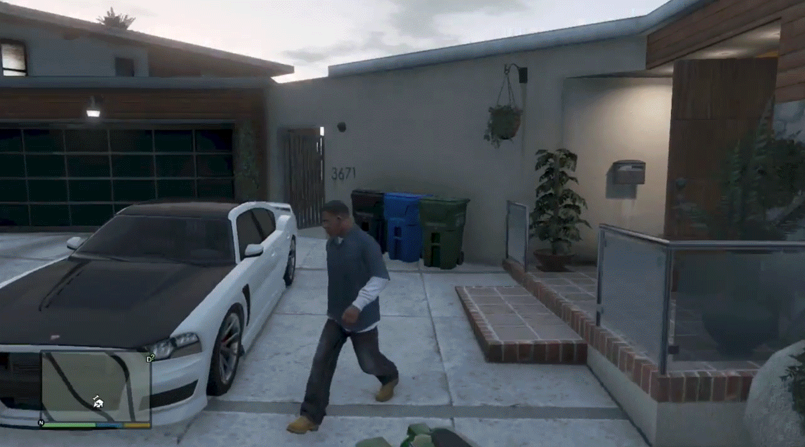
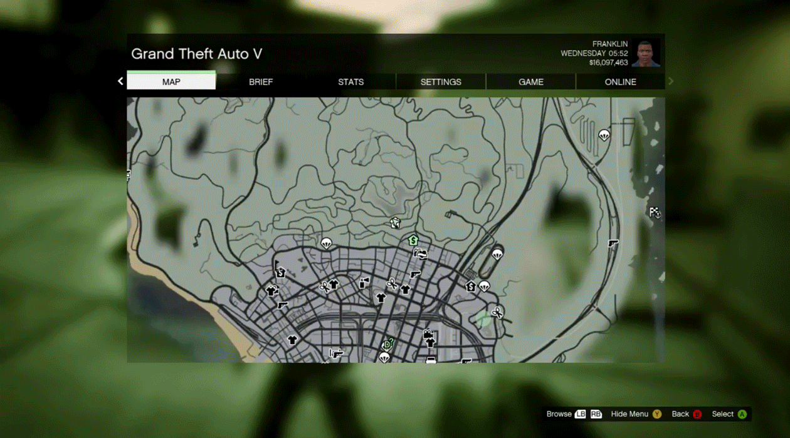
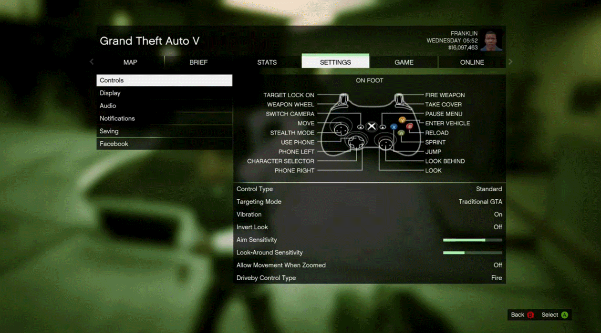
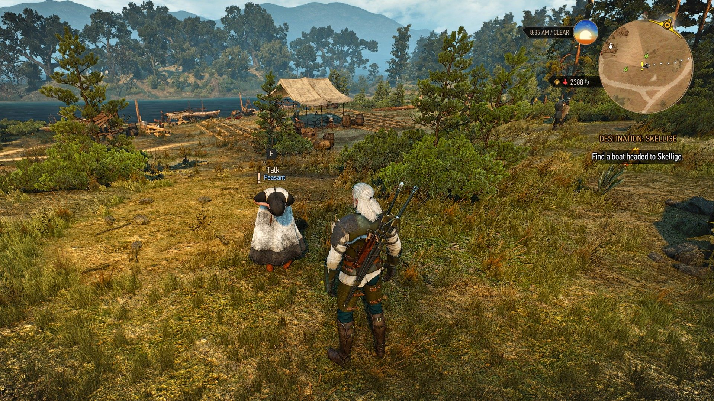
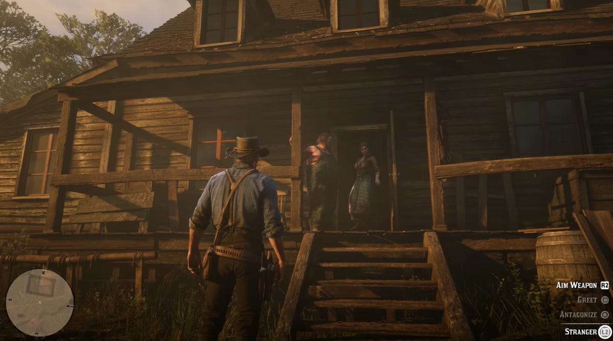
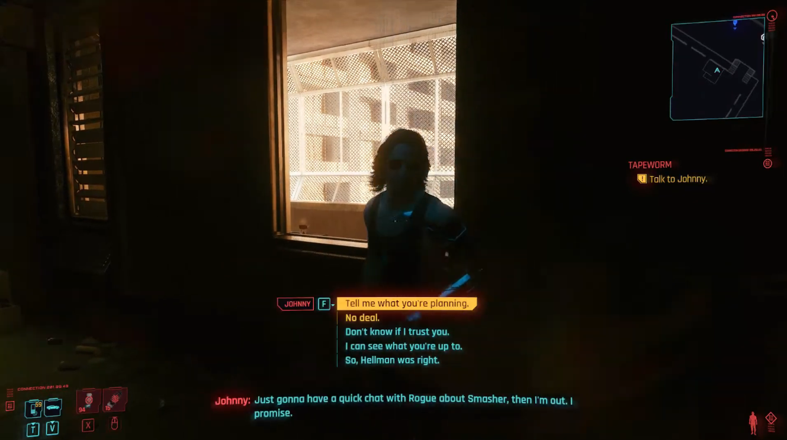

# Grand Theft Astra: interface specification

**Status: proposed revision, awaiting approval. The previous HUD, pause menu, and conversation layout failed review.**

This document replaces the previous menu proposal. Application changes stop until Alexander approves this specification.
The approved Moscow artwork remains. Alexander owns browser checks. No Storybook work is included.

## Goal

Keep Red Square and its people visible during play. Use GTA V's menu structure and spatial RPG conversation controls.
Every visible action must have a real effect. Every displayed fact must come from the game.

The rejected screenshots show five concrete problems:

1. Permanent buttons and a large mission card obscure the world.
2. The map fits the whole narrow district into a wide panel, making landmarks unreadable.
3. A tall logo, large gaps, and repeated headings waste menu space.
4. Inventory and mission information appear as sparse forms inside large black rectangles.
5. Conversation requires a person dropdown and a chat panel, separating the player from the person ahead.

## Inspected examples from real games

These captures are design references, not runtime assets. We inspected the images, including the controls and their placement.
All dimensions, timing, colors, and Astra behavior below are our proposed adaptations, not measured Rockstar specifications.

### GTA V: HUD, map, and settings

Josimar identifies his role as GTA V's Lead Graphic Designer and publishes these interface captures.
The normal HUD has a small minimap with thin bars below it. The pause screen has a compact title and tab strip.
The map fills the content area. Settings use a category list and compact rows, with white selection fill.
[Primary source](https://josimar.com/gtav.html), [original capture sequence](https://josimar.com/imgs/GTAV_Menu_And_HUD_Screenshots.gif).

[Expanded map capture](menu-references/gta-v-expanded-map-designer.png).
The four images come from frames 2, 4, 6, and 9 of the published GIF, using zero-based frame numbers.

The official manual describes a rotating local minimap and context-dependent information, including vehicle names on entry.
[GTA V manual](https://dlassets-ssl.xboxlive.com/public/content/4f0a3089-ba2c-4f3d-9e38-102a41cbd885/GameManual/bffef18e-3f19-4190-a9b1-75402359b13b/en-IL/index.html).
Rockstar places controls, audio, camera, and display under Settings.
[Rockstar Support](https://support.rockstargames.com/articles/1FKIriVNBHL72WZ0hrVT8u/adjusting-settings-within-gtav).

### The Witcher 3: approach a person

The visible person has an E / Talk prompt above her. No character list is open.
Our adaptation uses one nearby target and one prompt beside that target.
[Source and original screenshot](https://guides4gamers.com/witcher-3-wild-hunt/quests/loves-cruel-snares/).

### Red Dead Redemption 2: actions stay in the world

Arthur and the stranger remain visible. Compact prompts sit at the lower-right edge.
Our adaptation reserves this area for contextual physical actions.
[Source: Rockstar gameplay capture published by Business Insider](https://www.businessinsider.com/red-dead-redemption-2-gameplay-photos-video-2018-8).

### Cyberpunk 2077: the speaker remains the subject

The person occupies the center. Response choices sit below his face, and subtitles sit near the bottom.
Our adaptation replaces predefined dialogue choices with free text. The screenshot establishes placement, not camera movement or transition timing.
[Source: SteelSeries gameplay guide](https://steelseries.com/blog/how-to-get-secret-ending-cyberpunk).

## Proposed gameplay HUD

Use a 1440 × 900 CSS-pixel reference viewport. Keep HUD elements inside a 4% safe area.
Use shared size tokens for narrower screens; do not enlarge panels to fill unused space.

| Element | Proposed behavior |
| --- | --- |
| Radar | Bottom-left, 220 × 140 px. Show the player's immediate area, direction, north, and meaningful markers. Remove the title, You legend, and button footer. |
| Health | One 4 px bar immediately below the radar. Show actual health. Do not add armor or ability bars without those systems. |
| Money | Top-right. Show on entry and for four seconds after a change. Show the balance in the pause header at all times. |
| Objective | One bottom-center line for six seconds when the objective changes. Keep its destination marker visible afterward. No card or button. |
| Location | Bottom-right for four seconds after entering an area. Hide it during conversation or competing action prompts. |

The radar follows the player. Rotate its geometry with player heading; keep marker symbols readable.
Show 60 m across on foot and 100 m across while driving. Never fit the whole district into the radar.
Use a 10 px player symbol and 8 px destination symbols, independent of map zoom.
Use a directional player symbol, a destination marker, and distinct symbols for usable vehicles and entrances.
Do not display every ordinary person as a dot. Use police markers only for actual police entities.

Remove the permanent Menu, Interact, and City overview buttons. Show one initial Escape hint, then remove it after use.
Pause remains available through Escape. Contextual controls remain clickable when the pointer is free.

Show ammunition and an aiming reticle only when the physics implementation supplies those states.
Do not invent wanted stars, weapon slots, armor, damage numbers, or mission rewards.
Display accepted money and mission changes as brief notices above the radar. A message submission alone never creates a success notice.

## Proposed pause menu

Use one compact title line: Grand Theft Astra. Put the player name and money at the right.
Reserve the stacked illustrated logo for title and loading screens.

The shell occupies 80% of viewport width, up to 1200 px, with 8% vertical margins.
Use a 40 px header, 32 px tabs, an 8 px gap, and a 28 px footer.
The world remains blurred behind it. The footer says “World continues” once and shows the active key prompts.

Tabs: **Map · Quests · Inventory · Settings · Game**.
Quests matches the concurrent physics control specification. Do not add Online, Store, Activity, or empty categories.

| Tab | Content and real actions |
| --- | --- |
| Map | Large map viewport. Pan, zoom, center on player, select a destination, and clear a destination. |
| Quests | Actual quests in a 30% left column. Current objective, known reward, and destination in the right column. “Track” selects its real destination. |
| Inventory | Actual carried items in the left column; selected item details on the right. Show “Empty” once when needed. Keep reputation and shelter in a compact summary. |
| Settings | Controls first. Audio appears when the music owner provides working controls. Use compact rows with values aligned right. |
| Game | Resume and Main menu as two selectable rows. One short automatic-save note. Preserve pending actions before leaving. |

Only the map requires a full rectangular background. Other tabs use translucent row groups sized to their contents.
Use a minimum row height of 36 px and 16 px internal spacing. Do not repeat the selected tab name as a large heading.
Eight control rows must fit without scrolling at 1280 × 720 with default text size.
At 200% text zoom, rows grow and columns scroll internally. Labels and active controls must remain reachable.

Inventory has no empty equipment grid or invented item illustration. Equip and ammunition controls appear only when the weapon implementation provides them.
Quest copy states the current action: “Talk to Mila”, “Deliver the parcel to Lev”, or “Find a bed”.
Use the current game terms for prices and rewards. Do not invent a new character or rewrite the mission in this interface pass.

### Map geometry and navigation

The current district is 104 m wide and 337 m long. Fitting it into every viewport causes the rejected narrow strip.
The pause map opens around the player, showing approximately 130 m across. The player pans to see the remaining district.

Use the existing scene coordinates and building footprints. Show real entrances and known landmarks.
Do not generate a fictional street map. Mark areas outside the playable district plainly; do not imply traversable streets there.

Keep north at the top in the pause map. Drag or arrow keys pan; scroll or plus/minus zoom; Home centers the player.
Select a known destination to set a marker. Track a quest to select its current destination.
Map and Quests change only the destination. They never open conversation or change its recipient.
Do not reuse the current person-selection callback, because that callback opens interaction.
The radar shows an edge marker when the destination is outside its view. Do not draw a route without pathfinding.

Map markers retain entity IDs. A moving destination follows that entity; an unavailable destination clears with a brief explanation.
For an indoor destination, track the building entrance outdoors and the person indoors.
City overview remains a secondary map action. It must show the existing camera view; it must not replace map navigation.

## Proposed RPG conversation

### Approach and start

Show one prompt beside the nearest visible person within the camera's focus area: **[E] Talk · Mila**.
Use the physics owner's target selection and visibility checks. A person behind a wall is not eligible.
The proposed physics specification uses a two-meter prompt range; the current server permits seven meters.
Coordinate that difference with the physics owner. This interface revision does not independently change server interaction rules.

Looking toward another eligible person changes the prompt. Pressing E starts conversation with the displayed person.
Lock that person's ID for the conversation. Nearby movement must never change the recipient of a draft or retry.
There is no M interaction menu, NPC dropdown, or generic Interaction header.

### Framing and speech

Use the existing camera to frame the person over the player's shoulder. Keep the person's face and Red Square visible.
Respect the existing camera collision system. If a closer view is obstructed, keep the safe third-person view.

Show the speaker name and current spoken text near the bottom center, within a maximum width of 720 px.
Use 24 px subtitles. Limit each visible segment to three lines and allow review of earlier segments.
Streaming text comes from saved conversation updates. It must not appear as invented thoughts or scripted speech.

Place one compact reply line below the subtitles: “Say something…”, with Enter / Send and Escape / Leave prompts.
The reply line uses the shared body style and has no large Send button, transcript card, or field labels.
Preserve the current 2000-character limit. Long drafts expand within the lower area, never across the speaker's face.
Limit the whole conversation area to 240 px or 32% of viewport height, whichever is smaller, at default text size.
The reply expands to three lines, then scrolls internally. Keep Send, Leave, and recovery controls visible.

History is available through a small “History” control during conversation. It replaces the subtitle region with an internally scrolling transcript.
History and the reply share the same height limit. They never stack into another large panel.
Escape closes history first, then leaves conversation. Reopening the same conversation restores its draft and saved turns.
Retain drafts per person for the current game session. The current single-draft hook needs a change to support this behavior.
Keep unfinished submissions separately from drafts; opening another conversation must not replace them.
Hide the objective, location label, and ordinary action prompts while conversation is active.

### State and input rules

| State | Visible result |
| --- | --- |
| Ready | Editable reply line; Enter sends nonempty text. |
| Sending or waiting | Compact “Sending…” or “Waiting for Mila…” beside the reply line. Preserve the existing rule for accepting another message. |
| Reply arriving | Show actual saved speech. Keep complete text in History. |
| Failed or uncertain | Keep the draft and any partial speech. Show the existing accurate recovery message and the applicable retry action. |
| Unavailable or out of range | Show “Conversation unavailable” or “Move closer”. Preserve the draft. Never substitute a scripted reply. |

Conversation owns input while its reply, History, or recovery controls are active.
Block movement, combat, and Map/Inventory shortcuts throughout that context. Tab moves focus between conversation controls.
Release pointer lock without opening Pause. A click to restore pointer lock must never fire or punch.
E starts conversation only on foot; helicopter E keeps its steering action.
Escape leaves the view without cancelling an accepted server action. Resume movement only after conversation releases input and pointer capture is restored.
Leaving the view must preserve uncertain submissions and their retry identity. Returning to the title remains blocked when acknowledgement is unresolved.
An unresolved submission keeps a compact recovery notice available after leaving, even if the person moves away.
Its retry uses the original person, message, and idempotency key. It must not select another person or submit a new message.
If the person leaves range or disappears, stop new submissions and release the close camera view.
Nearby players' speech remains a subtitle near its speaker; it must not replace the active conversation's reply or history.

Mila's delivery and Irina's rental use the existing free-text conversation system.
Do not restore scripted Ask for work, Accept delivery, or Rent bed buttons inside this conversation.
The server still validates offers, acceptance, money, proximity, and saved effects.
The [conversation specification](../npc-conversation-design.md) owns those rules.

### Other world interactions

People, doors, objects, and vehicles share prompt typography. They do not share a generic menu.
The prompt names the actual action: Talk, Enter, Leave, Pick up, or Enter vehicle.
The physics specification owns E for the displayed interaction, F for vehicles, and mouse input for combat.
Do not put Hit in the conversation interface or intercept combat input from the physics owner.

Preserve the existing robbery action as an explicit secondary prompt at an eligible business.
Proposed binding: hold G for 600 ms while “Rob” is visible. Leaving range or releasing G cancels the hold.
Coordinate this new binding with the physics owner before implementation. Approach or ordinary E interaction must never trigger robbery.

## Typography and shared design

Use one UI family: **Roboto Condensed**, regular 400 and bold 700. Use the normal style only.
Its official Google Fonts metadata lists an OFL license and Latin/Cyrillic support.
[Font source and license](https://github.com/google/fonts/tree/main/ofl/robotocondensed).
This is our font choice; it is not a claim about GTA's font.

| Token | Use |
| --- | --- |
| Small: 12/16 px | Key prompts, short metadata, map labels |
| Body: 16/20 px | Menu rows, tabs, inputs, descriptions |
| Display: 24/28 px | Subtitles, money, menu title |

Use regular weight for rows and dialogue. Use bold only for selection, speaker names, and short headings.
Uppercase applies to tabs and compact key labels. Descriptions and speech use sentence case.
The illustrated logo is a separate asset. No additional UI font, italic style, or one-off type size is needed.

Use near-black translucent surfaces, warm white text, muted gray metadata, and brick red selection accents.
Use a thin red rule and white fill for the active menu row. Keyboard focus uses one restrained outline.
Keep panels square. Use text shadow over the world and a subtle lower gradient behind subtitles.
Color never carries selection, destination, or failure meaning alone. Use a symbol or text with it.

Reuse the current token files, controls, dialogs, artwork catalog, and scene components.
Document shared component use in [the interface guide](../../apps/web/src/ui/README.md) after implementation.
Self-host the font with its license. Keep artwork replacement paths stable for Angela.

## Title, loading, and recovery

The retained references are the [classic GTA V entry capture](menu-references/gta-v-entry.jpg) and [loading capture](menu-references/gta-v-loading.png).
Their sources are the [GTA 5 Forum entry discussion](https://www.gta-5-forum.de/technische-probleme-pc-version/16170-haengt-ladebildschirm.html) and [GTA World loading discussion](https://forum.gta.world/en/topic/42405-infinite-loading-screen/).
The [user-supplied loading capture](menu-references/gta-v-loading-user-reference.png) establishes the character extending beyond the framed background.

Keep the approved [Red Square arrival](grand-theft-astra/entry-v1.png) as the fixed main-menu artwork.
Use the existing title composition and compact actions. Enter Red Square starts the saved session; Controls opens the real bindings.

Loading cycles [GUM at midnight](grand-theft-astra/loading-gum-midnight-v1.png), [winter Red Square](grand-theft-astra/loading-winter-morning-v1.png), and [Moscow metro](grand-theft-astra/loading-moscow-metro-v1.png).
Keep the title and loading status fixed. End loading when the scene is ready, even before the image cycle finishes.
Use “Loading…” instead of implementation stages. Show no fake percentage or unnecessary tip paragraph.
Failures show a short readable message and a working retry action. A connection loss disables unavailable actions without hiding saved progress.

Keep editable assets in `source/interface/` and runtime assets in `public/assets/interface/`.
[Production prompts](../../source/interface/prompts.md) and [original selection prompts](grand-theft-astra/prompts.md) retain the approved generation work.
The [arrival loading option](grand-theft-astra/loading-arrival-v1.png) remains available as a replacement.

Technical details appear only with `VITE_GAME_DEBUG=true`.
That flag gates entity inspection, memory, coordinates, population counts, provider details, and transport errors.
Player recovery instructions remain visible without the flag. Debug views must not change available game actions.

## Implementation ownership after approval

| Files or owner | Planned change | Correctness check |
| --- | --- | --- |
| `ui/astra-*.css`, shared controls | Replace spacing and typography rules; preserve artwork components. | Three type sizes, two weights, consistent focus and short-screen fit. |
| `game-hud.tsx`, `minimap.tsx`, mission model | Local radar, contextual information, real destinations. | Shared coordinates; correct indoor targets; no stale destination. |
| `pause-*.tsx`, menu state | Compact tab shell, rows, functional map and Settings. | Keyboard ownership, real actions, no clipping at 1280 × 720. |
| Interaction components and conversation owner | World target prompt, locked speaker, subtitles, compact reply and History. | Draft restoration, safe retry, streamed speech, range changes. |
| Physics and music owners | Reuse target selection, camera/input ownership, and actual audio preferences. | No duplicate bindings or camera controllers; settings change sound. |

Review current files before editing because other agents work in the repository.
Keep the existing scene, server contracts, saves, assets, and conversation effects intact.
The full-screen scene remains the entry point for camera, physics, and sound integration.

## Approval and completion proof

Approval covers the five tabs, compact HUD, local map, spatial conversation, font, and contextual action behavior described above.
Application implementation starts only after that approval.

1. Implement the approved shared styles and menu structure.
2. Integrate the radar, map destinations, and world prompts with their existing owners.
3. Integrate conversation framing and text without replacing conversation transport or action rules.
4. Obtain an independent review; fix findings and run the existing required checks.
5. Give Alexander the implemented screens for browser review against these reference images.

Browser acceptance requires legible maps, eight visible control rows, clear faces during conversation, correct input ownership, and successful recovery.
Check 1440 × 900 and 1280 × 720 layouts, plus keyboard navigation and zoomed text.
Verify the delivery and bed-rental journey, a reconnect, and a conversation retry without duplicate effects.
Do not call the visual revision complete before Alexander reviews the implemented screens.
